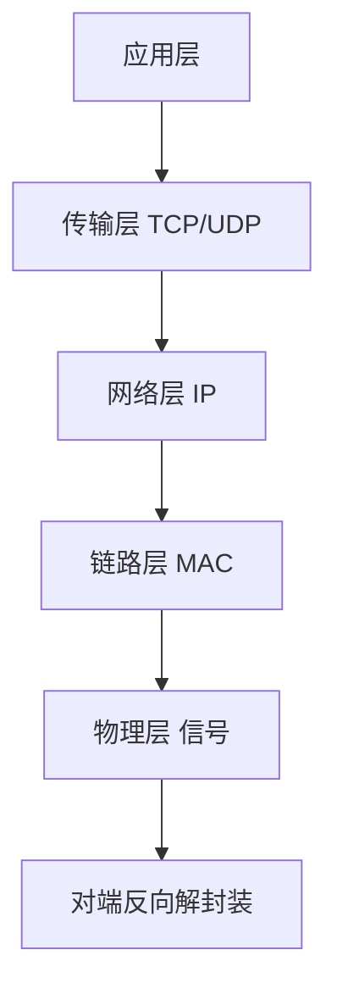
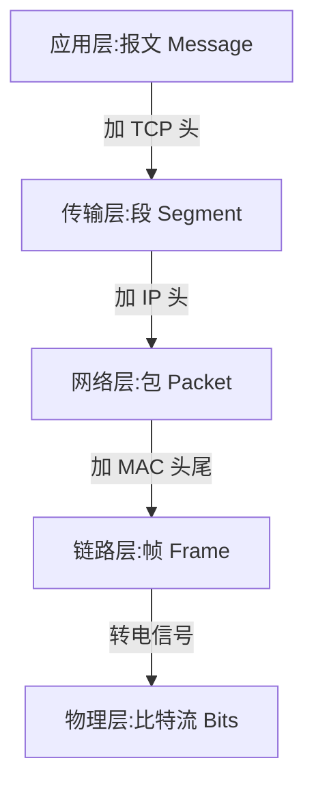

# 4.1 网络分层模型

> 卷:卷四 · 网络与通信
> 阅读时间:20min

---

## 引言:一次请求,数据要"过五关"

分层模型回答一个核心问题:**数据从 A 出发,经过哪些层、每层干了什么,最后到 B**。深挖要懂"封装/解封装"的 PDU 变化,以及 OSI 七层与 TCP/IP 四层的对应。

---

## 一、两套模型



| OSI 七层 | TCP/IP 四层 | 职责 | 协议 |
|---------|-------------|------|------|
| 应用/表示/会话 | 应用层 | 面向用户 | HTTP、DNS、FTP |
| 传输层 | 传输层 | 端到端、端口 | TCP、UDP |
| 网络层 | 网络层 | 寻址、路由 | IP、ICMP |
| 数据链路/物理 | 网络接口层 | 相邻传输、物理 | 以太网、MAC |

---

## 二、封装/解封装:每层的"数据单元(PDU)"



> **PDU 记忆**:报文(Segment 段)→ 包(Packet)→ 帧(Frame)→ 比特。每层只关心自己的头,不管别层内容——这就是"封装"。

**一个具体例子(发"你好")**:应用层 HTTP 组织报文 → 传输层加端口/校验 → 网络层加 IP → 链路层加 MAC → 物理层转信号 → 对端逐层解封装还原。

---

## 三、各层关键概念

| 层 | 关键词 | 比方 |
|----|--------|------|
| 应用层 | 说什么 | 信的内容 |
| 传输层 | 怎么可靠送达(端口) | 快递公司 |
| 网络层 | 送到哪(IP) | 收件地址 |
| 链路层 | 下一跳给谁(MAC) | 中转交接 |

> IP 是"地址"(定位到主机),MAC 是"门牌"(相邻设备),端口是"收件的具体程序"。

---

## 四、为什么分层(底层价值)

1. **解耦**:每层独立演进(HTTP/2 换不动 TCP)
2. **标准化**:层间接口统一,互通
3. **可替换**:网线换 WiFi,上层无感

---

---

**DNS 解析流程(域名 → IP):**

浏览器先查**本地缓存**(浏览器缓存 → 系统 hosts → 路由器 → ISP),都没有则向 DNS 服务器**递归 + 迭代**查询:

```
1. 根域名服务器 → 返回 .com 顶级域名服务器地址
2. .com 服务器 → 返回 example.com 权威服务器地址
3. 权威服务器 → 返回真实 IP
```

> 本地缓存逐层 → 根 → 顶级 → 权威。DNS 慢会拖慢首屏(可用 `preconnect`/`dns-prefetch` 提前解析,见 [10.2](/卷十-性能优化与工程质量/10.2-加载性能))。

**TCP 三次握手(建立连接):**

```
客户端 → SYN → 服务器
客户端 ← SYN+ACK ← 服务器
客户端 → ACK → 服务器
```

**为什么是三次不是两次?** 两次无法防止"失效的旧连接请求"造成资源浪费;第三次 ACK 让双方都确认"能收能发"。

**四次挥手(断开):** FIN → ACK → FIN → ACK(TCP 全双工,两个方向要分别关闭)。

📎 官方:[MDN《DNS》](https://developer.mozilla.org/zh-CN/docs/Glossary/DNS) · [TCP 握手](https://developer.mozilla.org/zh-CN/docs/Glossary/TCP_handshake)

## 五、小结

```
分层:应用(HTTP)→ 传输(TCP/UDP,端口)→ 网络(IP,寻址)→ 链路/物理(MAC/信号)
封装/解封装:报文→段→包→帧→比特;每层只认自己的头
前端关注应用层;断网/换IP等去下面几层找原因
```

---

## 六、面试题

**Q1:TCP 和 UDP 的区别?**

| | TCP | UDP |
|---|-----|-----|
| 连接 | 面向连接(三次握手) | 无连接 |
| 可靠性 | 可靠(重传/顺序) | 不可靠 |
| 速度 | 慢 | 快 |
| 场景 | HTTP、文件 | 视频通话、直播、DNS |

**Q2:什么是"封装"和"解封装"?**

封装:发送端**每层加自己的头**(应用→传输加 TCP 头→网络加 IP 头→链路加 MAC 头尾→物理转信号);解封装:接收端**逐层拆头还原**。各层只处理自己这层的协议。

**Q3:IP 地址和 MAC 地址的区别?**

IP 是**网络层**逻辑地址(定位主机、可变化);MAC 是**链路层**物理地址(硬件唯一、局域网内相邻传输用)。类比:IP 是"收件地址",MAC 是"门牌号",端口是"收件人"。

**Q4:为什么说前端主要关注"应用层",但又要懂下面几层?**

前端直接打交道的是应用层(HTTP)。但"断网仍能开页"(缓存,4.3)、"换 IP 后连接变化"、TLS 握手、DNS 慢等性能/排查问题,都要到传输/网络层找原因。分层让"上层能力、下层兜底"。

**Q5:浏览器断网后为什么有时还能"打开"页面?**

因为命中**浏览器 HTTP 缓存**(应用层就返回了缓存),根本没走到传输/网络层。只有缓存未命中、需真网络请求时才因断网失败——"上层能兜底就不麻烦下层"的直接体现。

**Q6:OSI 七层和 TCP/IP 四层的对应关系?**

OSI:应用/表示/会话 → 对应 TCP/IP 应用层;传输层 → 传输层;网络层 → 网络层;数据链路层/物理层 → 网络接口层。TCP/IP 是实际工程模型,OSI 是教学参考。

---

📎 参考:[MDN《网络如何工作》](https://developer.mozilla.org/zh-CN/docs/Learn_web_development/Howto/Web_mechanics/How_does_the_Internet_work)、RFC 1122、RFC 1123