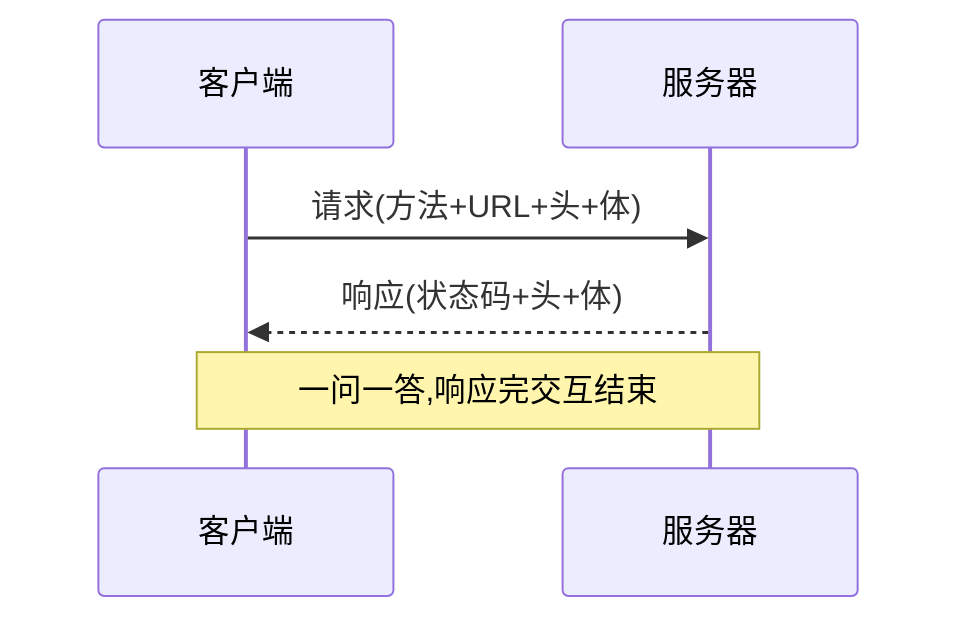

# 4.2 HTTP 报文与协议

> 卷:卷四 · 网络与通信
> 难度:⭐⭐ 进阶 | 阅读时间:25min | 状态:深度增强

---

## 引言:HTTP 的核心就是"请求-响应"两件事

HTTP 规定了**怎么传**(模式)和**长什么样**(格式)。深挖要懂"无状态"的含义与补状态的手段,以及**持久连接**。

---

## 一、请求-响应模式(一图)



---

## 二、报文格式:四段

```http
POST /api/login HTTP/1.1          ← 起始行
Host: study.duyiedu.com           ← 头部
Content-Type: application/json
                                  ← 空行
{"loginId":"admin"}               ← 主体
```

> 请求的 `Content-Type` 描述**请求体**,响应的描述**响应体**,互不相干。

---

## 三、请求方法与状态码

| 方法 | 语义 |
|------|------|
| GET/POST/PUT/PATCH/DELETE | 查/增/整体改/局部改/删 |
| HEAD | 只取头 |
| OPTIONS | 预检(4.6) |

| 状态码 | 含义 |
|--------|------|
| 1xx | 信息 |
| 2xx | 成功(200/201/204/206) |
| 3xx | 重定向/缓存(301/302/304) |
| 4xx | 客户端错(400/401/403/404/429) |
| 5xx | 服务器错(500/502/503/504) |

**易错:** `301`(永久重定向,缓存新址)/`302`(临时)/`304`(未修改,用缓存)。

---

## 四、深层:无状态 + 持久连接

### 1. HTTP 是"无状态"的

> 服务器**不记住**上一次请求是谁。每个请求独立。所以登录态要靠**补充机制**:`Cookie`(请求自动带)、`Authorization`(Token)、`Session`(服务端状态 + Cookie 存 id)。

### 2. 持久连接(Keep-Alive)

HTTP/1.1 默认**一条 TCP 连接可复用多次**,避免每次都三次握手:

```http
Connection: keep-alive   /* 默认;Connection: close 则用完即关 */
```

> 好处:省握手开销。代价:连接占用资源。HTTP/2 进一步用**多路复用**在一条连接上并发多请求(4.4)。

### 3. GET 不带请求体(约定)

规范里 GET 只是语义"获取",但工程形成约定:**GET 不携带请求体**(参数走 URL/头)。这约定深刻影响了前后端设计(敏感数据用 POST + 请求体)。

---

## 五、常见 Content-Type

| 值 | 用途 |
|----|------|
| `application/json` | JSON(最常用) |
| `application/x-www-form-urlencoded` | 表单 |
| `multipart/form-data` | 文件上传 |
| `text/html` / `text/plain` | 文档/纯文本 |
| `application/octet-stream` | 二进制(下载) |

---

## 六、小结

```
HTTP = 请求-响应模式 + 报文四段(起始行/头部/空行/主体)
无状态 → Cookie/Token/Session 补状态;Keep-Alive 持久连接
状态码:301/302 重定向,304 缓存;GET 不带体(约定)
```

---

## 七、面试题

**Q1:`401` 和 `403` 的区别?**

`401` **未认证**(没登录/凭证无效),"得先登录";`403` **无权限**(知道你是谁,但不允许)。

**Q2:`502` 和 `504` 的区别?**

`502`:网关从上游拿到**错误响应**(上游挂了/非法响应);`504`:网关**等上游超时**。前者"答错了",后者"没答"。

**Q3:HTTP 为什么是"无状态"的?怎么补状态?**

协议层面服务器不记忆历史请求,每个请求独立。补状态:Cookie(自动带)、Token(Authorization 头)、Session(服务端存状态 + Cookie 存 id)。

**Q4:`301` 和 `302` 的区别?浏览器如何处理?**

`301` **永久**重定向(浏览器/搜索引擎**缓存**新地址,下次直接去);`302` **临时**(每次仍回原地址)。对 SEO 影响也不同(301 转移权重)。

**Q5:HTTP/1.1 的"持久连接"解决什么问题?**

默认 `keep-alive`,**一条 TCP 连接复用多次**,省掉每个请求都做三次握手 + 慢启动的开销。这是相对 HTTP/1.0(每请求一连接)的关键优化。

**Q6:为什么敏感登录数据用 POST 而非 GET?**

约定 GET 参数在 URL(出现在浏览器历史、日志、Referer),泄露风险高;POST 放请求体,相对安全(仍需 HTTPS 真正加密,4.4)。

---

📎 参考:MDN《HTTP 消息》《HTTP 状态码》、RFC 9110