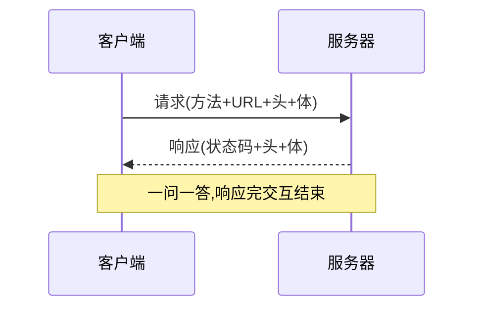

# 4.2 HTTP 报文与协议

## 引言:HTTP 的核心就是"请求-响应"两件事

HTTP 规定了**怎么传**(模式)和**长什么样**(格式)。深挖要懂"无状态"的含义、**幂等性**、**持久连接**,以及 HTTP 从 0.9 到 3 的演进。

---

## 一、请求-响应模式



---

## 二、报文格式:四段

```http
POST /api/login HTTP/1.1          ← 起始行
Host: study.duyiedu.com           ← 头部
Content-Type: application/json
                                  ← 空行
{"loginId":"admin"}               ← 主体
```

> 请求的 `Content-Type` 描述**请求体**,响应的描述**响应体**,互不相干。

**怎么亲眼看到报文:**

```bash
curl -v https://example.com   # -v 打印完整的请求头 + 响应头
```

或 **DevTools → Network → 点开任意请求 → Headers 面板**,看"Request Headers"和"Response Headers"。

---

## 三、报文头的分类

| 分类 | 说明 | 例子 |
|------|------|------|
| 通用头 | 请求/响应都可用 | `Cache-Control`、`Date` |
| 请求头 | 仅请求 | `Host`、`Accept`、`User-Agent`、`Authorization` |
| 响应头 | 仅响应 | `Server`、`Set-Cookie` |
| 实体头 | 描述 body | `Content-Type`、`Content-Length`、`Content-Encoding` |

---

## 四、请求方法:语义 + 幂等性 + 安全

| 方法 | 语义 | 幂等? | 安全? |
|------|------|-------|-------|
| GET | 查 | ✅ | ✅ |
| HEAD | 只取头 | ✅ | ✅ |
| POST | 增(不幂等) | ❌ | ❌ |
| PUT | 整体替换 | ✅ | ❌ |
| PATCH | 局部修改 | ❌ | ❌ |
| DELETE | 删 | ✅ | ❌ |
| OPTIONS | 预检(4.6) | ✅ | ✅ |

**三个关键概念:**

1. **安全方法**:不改变服务器状态的(只有 GET/HEAD)
2. **幂等方法**:执行多次结果一致(GET/PUT/DELETE/HEAD)
3. **POST vs PUT**:POST 每次**创建新资源**(不幂等);PUT 每次**整体替换同一资源**(幂等)

```js
// POST 两次 → 两个资源(不幂等)
POST /api/user { name: "a" }   // → 创建 id=1
POST /api/user { name: "a" }   // → 创建 id=2

// PUT 两次 → 同一个资源(幂等)
PUT /api/user/1 { name: "b" }  // → id=1 被替换成 b
PUT /api/user/1 { name: "b" }  // → id=1 还是 b
```

> 幂等性是**分布式系统重试**的基础:幂等的请求(如 PUT/DELETE)网络失败重发无副作用;非幂等(如 POST 扣款)重发需幂等键去重。

---

## 五、状态码详解

| 状态码 | 含义 |
|--------|------|
| 1xx | 信息(101 协议升级) |
| 2xx | 成功:200 OK / 201 已创建 / 204 无内容 / **206 部分内容** |
| 3xx | 重定向:301 永久 / 302 临时 / **304 未修改**(缓存) |
| 4xx | 客户端错:400 参数 / 401 未认证 / 403 无权限 / 404 / **429 限流** |
| 5xx | 服务器错:500 / 502 网关错误 / 503 不可用 / 504 网关超时 |

**易错点:**

- `301`(永久,缓存新址)/ `302`(临时)/ `304`(未修改,走缓存)
- `206`:范围请求(断点续传、视频拖动)
- `429`:被限流(触发频率限制)

---

## 六、深层:无状态 + 持久连接

### 1. HTTP 是"无状态"的

服务器**不记住**上一次请求是谁,每个请求独立。补状态靠: `Cookie`(请求自动带)、`Authorization`(Token)、`Session`(服务端状态 + Cookie 存 id)。

### 2. 持久连接(Keep-Alive)

HTTP/1.1 默认**一条 TCP 连接可复用多次**,避免每次都三次握手:

```http
Connection: keep-alive   /* 默认;Connection: close 则用完即关 */
```

> 好处:省握手开销;代价:连接占用资源。HTTP/2 进一步用**多路复用**在一条连接上并发多请求。

### 3. GET 不带请求体(约定)

规范里 GET 语义是"获取",但工程形成约定:**GET 不携带请求体**(参数走 URL/头)。这约定深刻影响前后端设计(敏感数据用 POST + 请求体)。

---

## 七、常见 Content-Type

| 值 | 用途 |
|----|------|
| `application/json` | JSON(最常用) |
| `application/x-www-form-urlencoded` | 表单 |
| `multipart/form-data` | 文件上传 |
| `text/html` / `text/plain` | 文档/纯文本 |
| `application/octet-stream` | 二进制(下载) |

---

## 八、HTTP 版本演进

| 版本 | 年代 | 关键特性 |
|------|------|---------|
| 0.9 | 1991 | 只有 GET,纯文本,无头 |
| 1.0 | 1996 | 引入头/状态码/POST,**每请求一连接** |
| 1.1 | 1997 | **持久连接 keep-alive**、Host 头、缓存、管线化 |
| 2.0 | 2015 | **二进制分帧、多路复用、头部压缩(HPACK)、服务器推送** |
| 3.0 | 2022 | 基于 **QUIC(UDP)**,0-RTT、解决队头阻塞 |


> 演进主线:**减少连接/握手开销 → 减少队头阻塞**。HTTP/2 多路复用解决"HTTP 层队头阻塞",HTTP/3 换 QUIC(UDP)解决"TCP 层队头阻塞"。详见 4.4(TLS)与 4.1(TCP)。

---

## 九、小结

```
HTTP = 请求-响应模式 + 报文四段(起始行/头部/空行/主体)
方法:安全(GET/HEAD)、幂等(GET/PUT/DELETE)、POST 不幂等
无状态 → Cookie/Token/Session 补状态;Keep-Alive 持久连接
状态码:301/302 重定向,304 缓存,429 限流;GET 不带体(约定)
演进:1.0(每请求连接)→1.1(keep-alive)→2(多路复用)→3(QUIC)
```

---

## 十、面试题

**Q1:`401` 和 `403` 的区别?**

`401` **未认证**(没登录/凭证无效),"得先登录";`403` **无权限**(知道你是谁,但不允许)。

**Q2:`502` 和 `504` 的区别?**

`502`:网关从上游拿到**错误响应**(上游挂了/非法响应);`504`:网关**等上游超时**。前者"答错了",后者"没答"。

**Q3:HTTP 为什么是"无状态"的?怎么补状态?**

协议层面服务器不记忆历史请求,每个请求独立。补状态:Cookie(自动带)、Token(Authorization 头)、Session(服务端存状态 + Cookie 存 id)。

**Q4:`301` 和 `302` 的区别?浏览器如何处理?**

`301` **永久**重定向(浏览器/搜索引擎**缓存**新地址);`302` **临时**(每次仍回原地址)。对 SEO 影响也不同(301 转移权重)。

**Q5:HTTP/1.1 的"持久连接"解决什么问题?**

默认 `keep-alive`,**一条 TCP 连接复用多次**,省掉每个请求都做三次握手 + 慢启动的开销。这是相对 HTTP/1.0(每请求一连接)的关键优化。

**Q6:为什么敏感登录数据用 POST 而非 GET?**

约定 GET 参数在 URL(出现在浏览器历史、日志、Referer),泄露风险高;POST 放请求体,相对安全(仍需 HTTPS 真正加密)。

**Q7:什么是"幂等性"?哪些方法幂等?为什么重要?**

幂等 = 执行**多次结果一致**。GET/PUT/DELETE/HEAD 幂等,POST 不幂等(每次建新资源)。幂等是**分布式重试**的基础:幂等请求失败重发无副作用,非幂等(扣款)需幂等键去重。

**Q8:POST 和 PUT 的区别?**

语义上 POST 是"增"(每次创建新资源,**不幂等**),PUT 是"整体替换指定资源"(**幂等**)。POST 发两次两个资源,PUT 发两次还是同一个。

**Q9:HTTP/2 相比 HTTP/1.1 的核心改进?**

① **二进制分帧**;② **多路复用**(一条连接并发多请求,解决 HTTP 层队头阻塞);③ **头部压缩**(HPACK);④ **服务器推送**。本质是"减少连接数 + 并发传输"。

**Q10:HTTP/3 为什么改用 QUIC(UDP)而不是继续用 TCP?**

QUIC 基于 UDP,在**传输层**实现可靠 + 加密 + 多路复用,解决 TCP 的**队头阻塞**(一个包丢失阻塞整条流)和握手慢的问题;支持 0-RTT 建连。这是"HTTP 演进到极致"的选择。

---

📎 参考:[MDN《HTTP 消息》](https://developer.mozilla.org/zh-CN/docs/Web/HTTP/Messages)、[MDN《HTTP 状态码》](https://developer.mozilla.org/zh-CN/docs/Web/HTTP/Status)、[MDN《HTTP 幂等性》](https://developer.mozilla.org/zh-CN/docs/Glossary/Idempotent)、RFC 9110