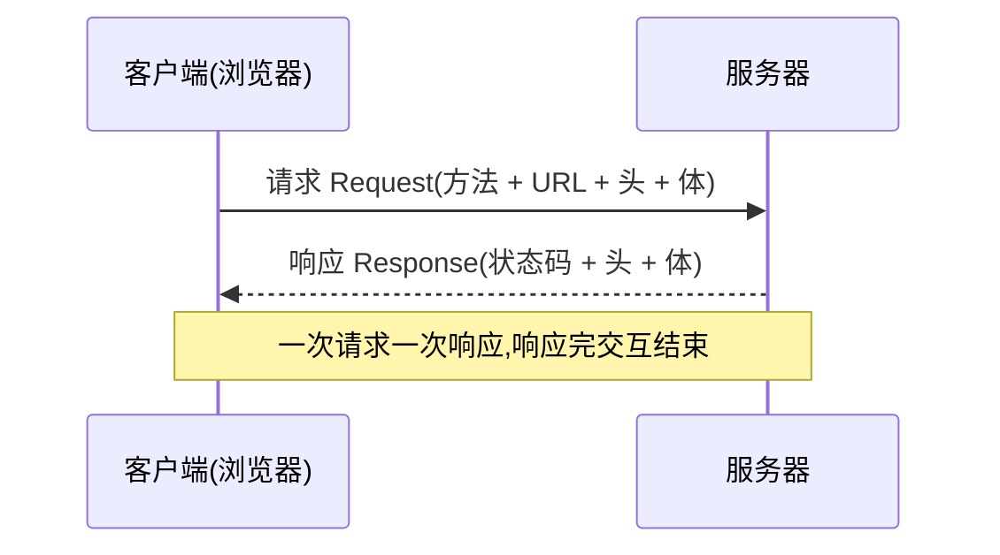

# 4.2 HTTP 报文与协议

> 卷:卷四 · 网络与通信
> 难度:⭐⭐ 进阶 | 阅读时间:25min | 状态:进行中

---

## 引言:HTTP 的核心就是"请求-响应"两件事

HTTP 规定了**消息怎么传**(模式)和**消息长什么样**(格式)。99% 的前端交互都在这个协议上跑,读懂报文,才能不看文档就排查问题。

---

## 一、请求-响应模式



- **客户端**发起请求、**服务器**返回响应,**响应完成交互即结束**(HTTP 本身无状态,靠 Cookie/Token 补状态)
- 本质是"一问一答",服务器不能主动"推"消息(要推得靠 WebSocket/SSE,见 4.5)

---

## 二、报文格式:三个部分

```http
POST /api/user/login HTTP/1.1          ← 起始行(方法 路径 版本)
Host: study.duyiedu.com               ← 头部(键值对)
Content-Type: application/json
                                       ← 空行(分隔头部与主体)
{ "loginId": "admin", "loginPwd": 1 }  ← 主体(请求体/响应体)
```

**四段法记**:起始行 → 头部(headers)→ **空行** → 主体(body)。

> 请求的 `Content-Type` 描述的是**请求体**格式;响应的 `Content-Type` 描述的是**响应体**格式,**两者互不相干**。

---

## 三、请求方法(语义约定)

| 方法 | 语义 | 常用场景 |
|------|------|---------|
| `GET` | 获取资源 | 查数据、加载页面 |
| `POST` | 提交/新增 | 登录、创建 |
| `PUT` | 整体更新 | 覆盖式修改 |
| `PATCH` | 局部更新 | 改部分字段 |
| `DELETE` | 删除 | 删资源 |
| `HEAD` | 只取响应头 | 探测资源 |
| `OPTIONS` | 预检 | CORS 预检(见 4.6) |

**GET vs POST 的"约定":**

> 规范里两者只有**语义区别**,但工程上形成约定:**GET 不携带请求体**(数据走 URL 的 query 或头部)。这约定反过来深刻影响了前后端设计。

---

## 四、状态码:五类

| 分类 | 含义 | 常见码 |
|------|------|--------|
| `1xx` | 信息 | `101`(升级 WebSocket) |
| `2xx` | 成功 | `200 OK`、`201 已创建`、`204 无内容`、`206 部分内容` |
| `3xx` | 重定向 | `301 永久`、`302 临时`、`304 未修改(缓存)` |
| `4xx` | 客户端错误 | `400 参数错`、`401 未认证`、`403 禁止`、`404 不存在`、`405 方法不允许`、`429 过频` |
| `5xx` | 服务器错误 | `500 内部错`、`502 网关错`、`503 不可用`、`504 网关超时` |

**高频易错:`301` vs `302` vs `304`**

- `301`/`302`:重定向(301 永久 → 浏览器缓存新地址;302 临时)
- `304`:不是错误!是"**你没变,用缓存吧**"(配合协商缓存,见 4.3)

---

## 五、常见 Content-Type

| 值 | 用途 |
|----|------|
| `application/json` | JSON 数据(最常用) |
| `application/x-www-form-urlencoded` | 表单(键值对编码) |
| `multipart/form-data` | 上传文件(二进制) |
| `text/html` | HTML 文档 |
| `text/plain` | 纯文本 |
| `application/octet-stream` | 二进制流(触发下载) |

---

## 六、小结

```
HTTP = 请求-响应模式 + 报文格式

报文四段:起始行 → 头部 → 空行 → 主体
方法:GET/POST/PUT/PATCH/DELETE(语义约定;GET 不带体)
状态码:1xx信息 2xx成功 3xx重定向/缓存 4xx客户端错 5xx服务器错
记忆:301/302 重定向,304 用缓存
```

---

## 七、面试题

**Q1:`401` 和 `403` 的区别?**

`401 Unauthorized`:**未认证**(没登录/凭证无效),语义是"得先登录再试";`403 Forbidden`:已认证但**无权限**("知道你是谁,但你不配")。

**Q2:`502` 和 `504` 的区别?**

`502 Bad Gateway`:网关从上游服务器拿到**错误响应**(上游挂了/返回了非法响应);`504 Gateway Timeout`:网关**等上游超时**(上游处理太久没响应)。前者是"上游答错了",后者是"上游没答"。

**Q3:为什么前端常用 `POST` 而非 `GET` 传敏感登录数据?**

因约定 GET 把参数放 URL,会**出现在浏览器历史、日志、Referer** 中,泄露风险高;POST 放请求体,相对安全(但仍需 HTTPS 才能真正加密,见 4.4)。

---

📎 参考:MDN《HTTP 消息》《HTTP 响应状态码》、RFC 9110