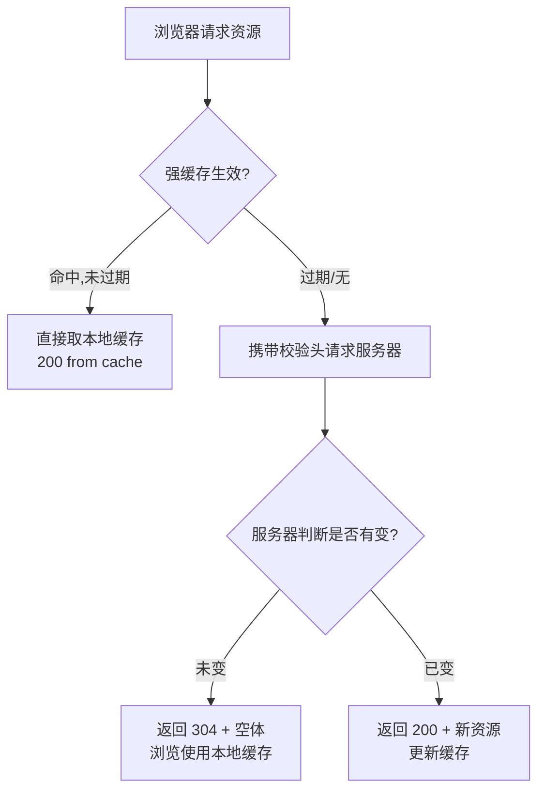
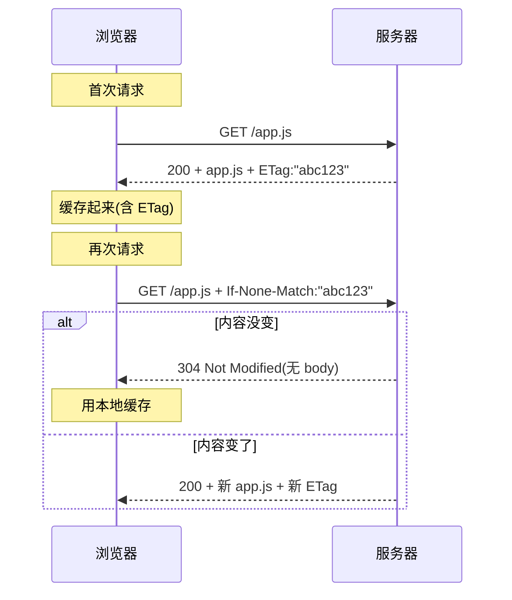

# 4.3 HTTP 缓存与协商

> 卷:卷四 · 网络与通信
> 难度:⭐⭐⭐ 专家 | 阅读时间:25min | 状态:进行中

---

## 引言:少发一次请求,就是最大的性能优化

HTTP 缓存是前端性能优化的"免费午餐":配置对了,资源直接从本地拿,**零网络请求**。本章讲清「强缓存 vs 协商缓存」两套机制,以及它们背后的响应头。

---

## 一、两类缓存(先分清)

| | 强缓存 | 协商缓存 |
|---|--------|---------|
| 触发 | 不请求服务器,直接本地取 | 请求服务器,但服务器说"用缓存" |
| 状态码 | `200`(from disk/memory cache) | **`304 Not Modified`** |
| 请求头 | 不发请求(或部分) | `If-None-Match` / `If-Modified-Since` |
| 速度 | 最快(0 网络) | 次快(有往返但无重复下载) |

**一句话:强缓存"问都不问",协商缓存"问了但不用重传"。**

---

## 二、决策流程(一张图)



---

## 三、强缓存:Cache-Control

响应头 `Cache-Control` 是主键,`Expires`(绝对时间)已基本被取代:

```http
Cache-Control: max-age=31536000      ; 缓存 1 年(相对时间,秒)
Cache-Control: no-store              ; 完全不缓存
Cache-Control: no-cache              ; 可缓存,但每次先协商(走 304)
Cache-Control: private               ; 仅浏览器私有缓存(不存 CDN)
Cache-Control: public, immutable     ; 公共缓存 + 内容永不变
```

**关键区分(易错):**

| 指令 | 含义 |
|------|------|
| `no-store` | 禁止缓存(数据敏感的才用) |
| `no-cache` | **能缓存,但每次要先协商**(不是"不缓存"!) |
| `max-age=N` | 相对时间,优先级高于 `Expires` |

---

## 四、协商缓存:ETag vs Last-Modified

强缓存过期后,浏览器带"校验凭证"问服务器:

| 方案 | 响应头(服务器给凭证) | 请求头(下次带去问) |
|------|---------------------|-------------------|
| **ETag**(优先) | `ETag: "v1.0"`(内容哈希) | `If-None-Match: "v1.0"` |
| Last-Modified(兜底) | `Last-Modified: 时间` | `If-Modified-Since: 时间` |

**流程(以 ETag 为例):**



**ETag 优于 Last-Modified 的原因:**

1. **精度**:ETag 到内容级(改 1 字节也变);Last-Modified 只到秒级,同秒内多次改会漏
2. **场景**:内容变了但时间没变(如文件被重写但 mtime 相同)时,ETag 仍能感知

---

## 五、前端工程实践:文件指纹 + 长缓存

这就是"解决浏览器缓存困扰"的最佳实践(配合打包器):

```
app.[contenthash].js      ← 文件名带内容哈希
```

- 内容不变 → 文件名不变 → **强缓存 `max-age=1年`**(零请求)
- 内容一变 → 文件名变了 → 新 URL → 自然拿到新文件,**无需担心"缓存没更新"**

```html
<!-- index.html 不缓存(频繁变),资源文件长缓存(带 hash) -->
<script src="/app.a1b2c3.js"></script>
```

> 这就是 webpack/Vite 的 `contenthash` 存在意义:让"缓存"和"更新"两全。

---

## 六、小结

```
HTTP 缓存两级:
强缓存(不请求,Cache-Control: max-age / no-store / no-cache)
  → 过期后进入协商缓存(请求但可能只返 304)
协商缓存:ETag / If-None-Match(优先,内容级)+ Last-Modified(秒级兜底)

实践:内容哈希文件名 + long max-age,HTML 短缓存
易错:no-cache ≠ 不缓存(是"先协商");304 不是错误
```

---

## 七、面试题

**Q1:`no-cache` 和 `no-store` 的区别?**

`no-store`:**不缓存**——响应体不存,每次都要完整请求。`no-cache`:可以缓存,但**每次使用前必须协商**——走 ETag/Last-Modified 拿到 304 才用本地缓存。一句话:`no-store` 是不存,`no-cache` 是存但每次验。

**Q2:为什么资源文件要"永久缓存 + 内容哈希文件名"?**

内容哈希让"内容一变,文件名就变",于是可以给资源设超长 `max-age`(甚至 immutable)极致命中最快;而更新时因为新文件名不同,天然绕过旧缓存。`index.html` 用短缓存/不缓存,保证用户总能拿到最新的入口,再引到正确 hash 资源。

**Q3:用户按 Ctrl+F5 强刷,缓存机制如何被绕过?**

强刷会发请求时**不携带协商缓存头**(或带 `Cache-Control: no-cache` 请求头),强制服务器返回完整新资源(200),从而跳过本地缓存。

---

📎 参考:MDN《HTTP 缓存》、RFC 9111、Google Web Fundamentals《HTTP 缓存》