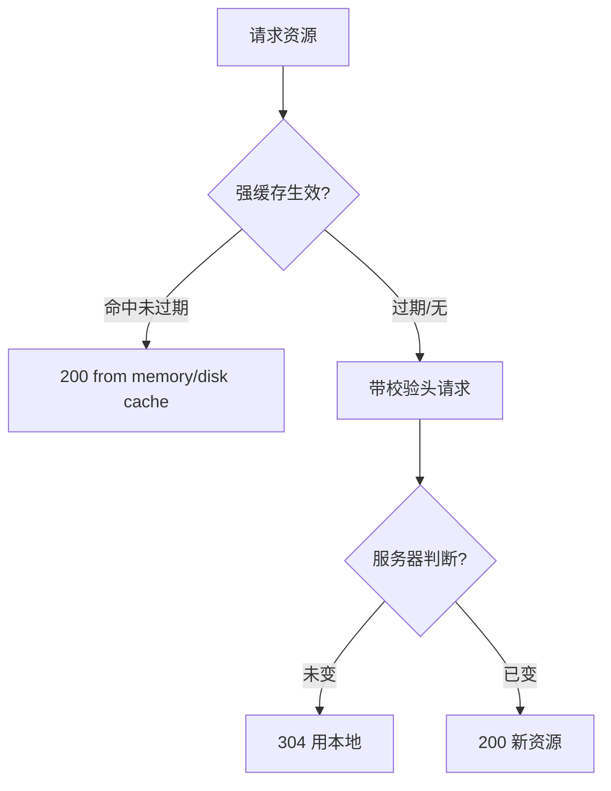
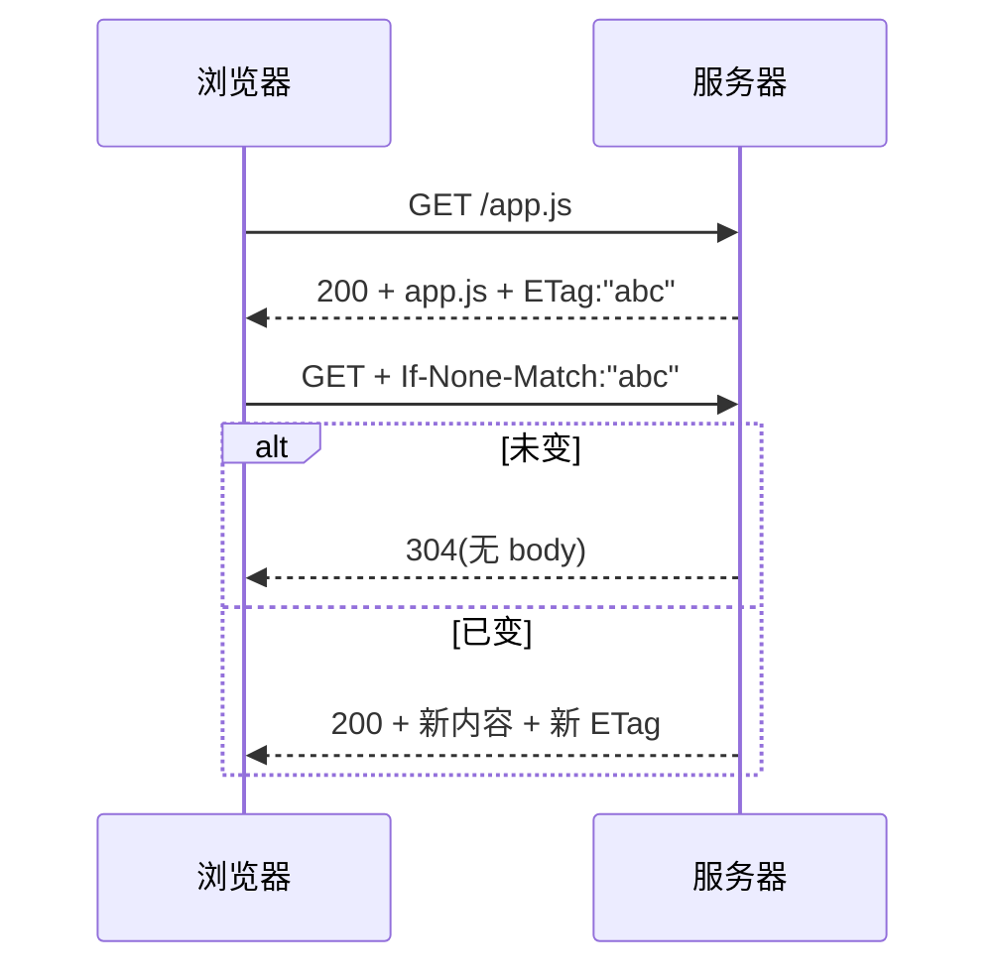

# 4.3 HTTP 缓存与协商

> 卷:卷四 · 网络与通信
> 阅读时间:30min

---

## 引言:少发一次请求,就是最大的性能优化

HTTP 缓存是"免费午餐":配置对了,资源本地拿、**零网络请求**。深挖要懂**缓存位置(memory/disk)**、**启发式缓存**、以及 **Vary** 等细节。

---

## 一、两类缓存(先分清)

| | 强缓存 | 协商缓存 |
|---|--------|---------|
| 触发 | 不请求,直接本地 | 请求了,但服务器说"用缓存" |
| 状态码 | `200`(from cache) | **`304`** |
| 请求头 | 不发 | `If-None-Match` 等 |

---

## 二、决策流程(一图)



---

## 三、强缓存:Cache-Control

```http
Cache-Control: max-age=31536000   ; 缓存 1 年(相对秒)
Cache-Control: no-store           ; 完全不缓存
Cache-Control: no-cache           ; 可缓存,但每次先协商(304)
Cache-Control: private / public   ; 仅私有 / 可公共(CDN)
Cache-Control: immutable          ; 内容永不变
```

**易错:** `no-store`(不存)vs `no-cache`(存但每次验)。

**深层:缓存位置**

- **memory cache**:内存缓存,快,进程内,关闭即清(当前页常用)
- **disk cache**:磁盘缓存,持久,跨进程/重启仍在

> 命中时 DevTools 显示 `(from memory cache)` / `(from disk cache)`。

---

## 四、协商缓存:ETag vs Last-Modified

| 方案 | 响应头 | 下次请求头 |
|------|--------|-----------|
| **ETag**(优先) | `ETag: "v1"` | `If-None-Match` |
| Last-Modified(兜底) | `Last-Modified` | `If-Modified-Since` |



**ETag 优于 Last-Modified:** ① 内容级精度(改 1 字节也变),Last-Modified 只到秒;② 内容变但时间不变时仍能感知。

---

## 五、深层细节:启发式缓存与 Vary

### 1. 启发式缓存(Heuristic Caching)

响应**没有** `Cache-Control`/`Expires` 时,浏览器可能按 **`Last-Modified` 的时间差**猜一个缓存期(如差值的 10%)。→ 所以"该设头的一定要显式设",别依赖启发式。

### 2. Vary:按请求头区分缓存副本

```http
Vary: Accept-Encoding
```

> 告诉缓存"同一 URL,因 `Accept-Encoding` 不同(gzip/br)要存**不同副本**",避免"给不支持 gzip 的客户端发 gzip 版本"这类错配。

---

## 六、工程实践:文件指纹 + 长缓存

```
app.[contenthash].js   ← 文件名带内容哈希
```

- 内容不变 → 文件名不变 → 强缓存 `max-age=1年`(零请求)
- 内容一变 → 文件名变 → 新 URL → 自然拿新文件

```html
<script src="/app.a1b2c3.js"></script>  <!-- 资源长缓存;HTML 短缓存/不缓存 -->
```

---

## 七、小结

```
两级:强缓存(不请求,Cache-Control:max-age/no-store/no-cache)→协商(304,ETag/Last-Modified)
位置:memory(快,进程内)/ disk(持久)
细节:no-cache≠不缓存;启发式缓存(无头时按时间差猜);Vary(按请求头分副本)
实践:contenthash + 长缓存;HTML 短缓存
```

---

## 八、面试题

**Q1:`no-cache` 和 `no-store` 的区别?**

`no-store` **不缓存**(每次完整请求);`no-cache` **可缓存但每次先协商**(走 304 才用)。一个不存,一个存但验。

**Q2:为什么资源文件要"永久缓存 + 内容哈希文件名"?**

内容哈希让"内容变则文件名变",于是可设超长 `max-age` 极致命中;更新时新文件名天然绕过旧缓存。HTML 短缓存保证总拿到新入口。

**Q3:强缓存和协商缓存的区别?各自触发什么状态码?**

强缓存**不请求服务器**,直接本地取,`200 from cache`;协商缓存**请求服务器**但只返回 `304`(未变),浏览器用本地。强缓存过期后才进协商。

**Q4:ETag 比 Last-Modified 好在哪?**

① **精度**:ETag 内容级(改 1 字节也变),Last-Modified 只到秒;② **可靠性**:内容变了但 mtime 没变(重写文件)时,ETag 仍能感知变化。

**Q5:什么情况下会命中"启发式缓存"?**

响应**没有 `Cache-Control`/`Expires`** 时,浏览器按 `Last-Modified` 与当前时间的差值**猜**一个缓存期(通常是差值的一小部分)。所以关键资源一定要显式设缓存头。

**Q6:`Vary` 头是干什么的?举例?**

告诉缓存"**按某个请求头区分缓存副本**"。如 `Vary: Accept-Encoding`,同一 URL 因压缩方式不同(gzip/br)存不同副本,避免给不支持某编码的客户端发错版本。

---

📎 参考:MDN《HTTP 缓存》、RFC 9111、Google Web Fundamentals《HTTP 缓存》