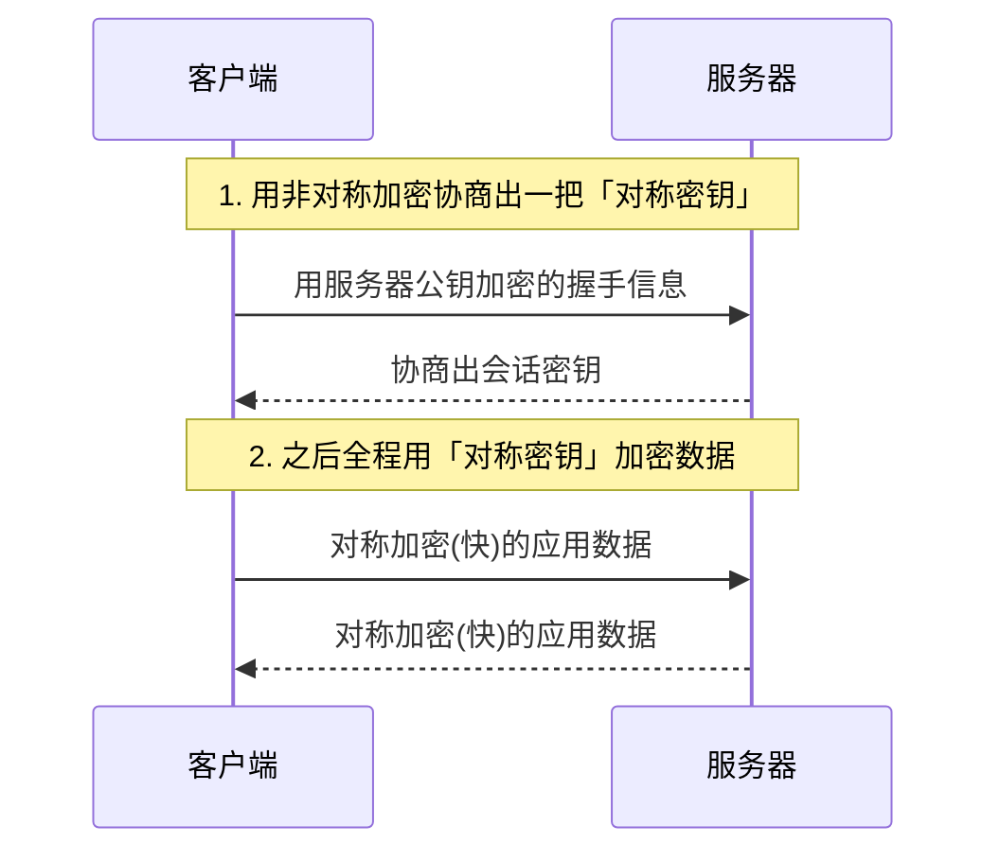
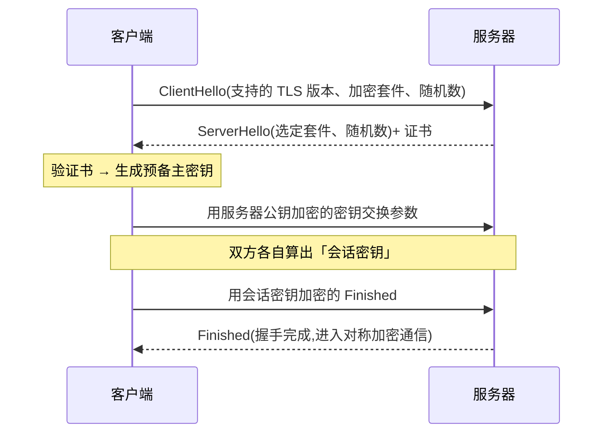

# 4.4 HTTPS 与 TLS

> 卷:卷四 · 网络与通信
> 难度:⭐⭐⭐ 专家 | 阅读时间:25min | 状态:进行中

---

## 引言:HTTP 为什么不安全,HTTPS 加了三把锁

HTTP 明文传输,有三大风险:**窃听、篡改、冒充**。HTTPS = HTTP + TLS,用「加密」防窃听、「完整性校验」防篡改、「证书」防冒充。理解它,面试"HTTPS 原理"才不是背书。

---

## 一、HTTP 的三大风险 → HTTPS 的三种对策

| 风险 | 含义 | HTTPS 对策 |
|------|------|-----------|
| 窃听 | 明文可被抓包看光 | **对称加密**(数据加密) |
| 篡改 | 中间人可改内容 | **完整性校验**(MAC/摘要) |
| 冒充 | 无法确认对方身份 | **证书 + 非对称加密**(验身份) |

---

## 二、两种加密:对称 vs 非对称

| | 对称加密 | 非对称加密 |
|---|---------|-----------|
| 密钥 | 一把,加解密同钥 | 一对公钥/私钥 |
| 速度 | **快** | **慢**(大数运算) |
| 用法 | 加密数据本体 | 交换密钥、验签名 |
| 代表 | AES、ChaCha20 | RSA、ECDHE |

**核心思路:混合加密**

> 非对称加密**慢**,不适合加密大量数据;对称加密**快**,但密钥怎么安全交给对方?答案:**用非对称加密交换"对称密钥",之后用对称加密传数据。**



---

## 三、证书与 CA:解决"公钥是谁的"

拿到公钥后,怎么确定它真的是目标服务器的、而非中间人伪造的?

- **证书**:包含"域名 + 该域名的公钥 + 签发者签名"
- **CA(Certificate Authority)**:受信任的第三方,用它的私钥给证书签名
- 验证链:浏览器用**内置的 CA 公钥**验证书签名 → 确认"这个公钥确实属于这个域名"

```
证书链:服务器证书 → 中间 CA → 根 CA(浏览器内置信任)
```

> 篡改证书会被签名校验识破,冒充域名会拿不到对应域名的合法证书——这就是 HTTPS 防"中间人"的核心。

---

## 四、TLS 握手(简版)



> 记忆要点:先**验证书**(防冒充)→ 再**非对称交换密钥**(防窃听密钥)→ 后**对称加密通信**(快)。

---

## 五、HTTP/1.1 → 2 → 3(演进一页)

| 版本 | 关键改进 | 痛点 |
|------|---------|------|
| HTTP/1.1 | 持久连接(keep-alive) | 队头阻塞、同一连接串行 |
| HTTP/2 | **多路复用**(一连接多请求并发)、头部压缩(HPACK)、二进制分帧、服务器推送 | 底层仍 TCP,丢包仍队头阻塞 |
| HTTP/3 | 基于 **QUIC(UDP)**、0-RTT 握手、彻底解决队头阻塞 | 新、UDP 相关中间设备适配 |

> 前端视角:HTTP/2 让"合并文件/雪碧图"这些老优化不再必要(多路复用本身就是并行);但要完整理解需到进阶场景。

---

## 六、小结

```
HTTPS = HTTP + TLS
三对策:对称加密(防窃听)+ 完整性校验(防篡改)+ 证书/CA(防冒充)

混合加密:非对称(慢)换对称密钥 → 对称(快)传数据
证书链:服务器证书 → 中间CA → 根CA(浏览器信任)
演进:1.1(持久连接)→ 2(多路复用/头部压缩)→ 3(QUIC/UDP,根治队头阻塞)
```

---

## 七、面试题

**Q1:为什么 HTTPS 用"混合加密"而不是纯非对称或纯对称?**

纯非对称**太慢**(大数运算,扛不住大流量);纯对称**密钥分发不安全**(明文发密钥等于没加密)。混合:非对称只用来**安全交换**对称密钥(少量数据、慢点没关系),之后大数据走对称加密(快),取两者之长。

**Q2:证书怎么防止被"中间人"伪造?**

①② 证书由受信任的 **CA 签名**;③ 伪造者即使自建证书,浏览器也会因**根证书不信任**而告警;④ 篡改证书内容会使**签名校验不通过**。所以中间人既拿不到真证书、也造不出能过签名的假证书。

**Q3:HTTP/2 的"多路复用"解决了什么问题?**

HTTP/1.1 同一连接上请求**串行**且有队头阻塞(前一个慢,后面全等)。HTTP/2 用**二进制分帧**,在同一条 TCP 连接上**并发传输多个请求/响应流**,消除队头阻塞、减少连接数、提升并发。(真正根治丢包级队头阻塞要等 HTTP/3 的 QUIC。)

---

📎 参考:MDN《HTTPS》《TLS》、RFC 8446(TLS 1.3)、Google Developers《HTTP/3》