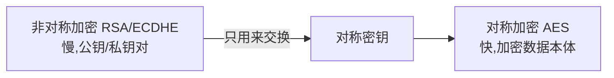
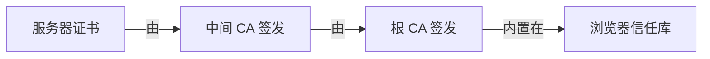
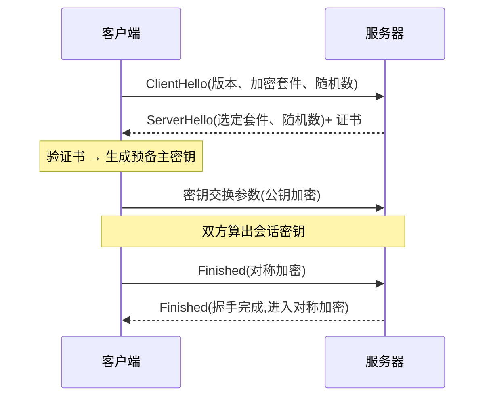

# 4.4 HTTPS 与 TLS

## 引言:HTTP 为什么"裸奔",HTTPS 加了三把锁

HTTP 明文传输,有三大风险:**窃听、篡改、冒充**。HTTPS = HTTP + TLS,用「加密」防窃听、「完整性校验」防篡改、「证书」防冒充。深挖要懂**混合加密**与**中间人攻击为何被证书链挡下**。

---

## 一、三风险 → 三对策

| 风险 | HTTPS 对策 |
|------|-----------|
| 窃听(明文被抓) | **对称加密** |
| 篡改(内容被改) | **完整性校验**(MAC/摘要) |
| 冒充(无法验身份) | **证书 + 非对称加密** |

---

## 二、两种加密 + 混合



| | 对称 | 非对称 |
|---|------|--------|
| 密钥 | 一把(同钥加解密) | 一对(公/私) |
| 速度 | **快** | 慢 |
| 用途 | 加密数据 | 交换密钥、验签名 |

**为什么混合?** 非对称慢、扛不住大流量;纯对称密钥分发不安全(明文发=没加密)。所以:**非对称交换对称密钥(少量数据)→ 对称加密数据(大量数据)**。

---

## 三、证书链:防冒充的根基



- 证书 = "域名 + 该域名公钥 + 签发者签名"
- 浏览器用**内置根 CA 公钥**逐级验签,确认"公钥确实属于该域名"

**中间人攻击(MITM)为何被挡下?**

> 攻击者想伪装成服务器:① 自建证书 → 浏览器因**根 CA 不信任**而告警;② 篡改真证书 → **签名校验不通过**;③ 冒充域名 → 拿不到该域名的合法证书。三者全堵死,这就是证书链 + CA 的价值。

---

## 四、TLS 握手(简版)



> **先验证书(防冒充)→ 非对称交换密钥(防窃听)→ 对称加密通信(快)**。

---

## 五、HTTP/1.1 → 2 → 3

| 版本 | 改进 | 痛点 |
|------|------|------|
| HTTP/1.1 | 持久连接 | 队头阻塞、串行 |
| HTTP/2 | **多路复用**、头部压缩、二进制分帧 | 底层 TCP,丢包仍阻塞 |
| HTTP/3 | 基于 **QUIC(UDP)**、0-RTT、根治队头阻塞 | 新、中间设备适配 |

---

## 六、小结

```
HTTPS = HTTP + TLS
三对策:对称加密(防窃听)+ 完整性校验(防篡改)+ 证书/CA(防冒充)
混合加密:非对称换对称密钥 → 对称传数据
证书链:服务器证书→中间CA→根CA(浏览器信任);MITM 被三路堵死
演进:1.1(持久)→2(多路复用)→3(QUIC/UDP)
```

---

## 七、面试题

**Q1:为什么 HTTPS 用"混合加密"而非纯对称/纯非对称?**

纯非对称太慢(大数运算);纯对称密钥分发不安全。混合:非对称只**安全交换**对称密钥(少量、慢没关系),大数据走对称(快),取长补短。

**Q2:证书怎么防止"中间人"伪造?**

① 证书由受信任 **CA 签名**;② 伪造者自建证书 → 根证书不受信任 → 浏览器告警;③ 篡改证书内容 → 签名校验不过;④ 冒充域名 → 拿不到合法证书。

**Q3:HTTP/2 的"多路复用"解决什么?**

HTTP/1.1 同连接请求**串行**、有队头阻塞;HTTP/2 用**二进制分帧**在同一条 TCP 上**并发多流**,消除队头阻塞、减连接数。(根治丢包级阻塞要 HTTP/3 的 QUIC。)

**Q4:TLS 握手的核心步骤?**

① ClientHello(版本/套件/随机数);② ServerHello + 证书;③ 客户端验证书、生成密钥交换参数;④ 双方算出会话密钥;⑤ Finished,之后对称加密通信。

**Q5:HTTPS 能保证绝对安全吗?**

不能。HTTPS 保"**传输安全**"(加密、防篡改、防冒充),但不防:终端被入侵、证书私钥泄露、恶意 CA 签发假证书、以及应用层逻辑漏洞(CSRF/XSS 等)。它是传输层安全,不是"万能安全"。

**Q6:`TLS 1.3` 相比 1.2 有哪些改进?**

① **握手从 2-RTT 降到 1-RTT**(0-RTT 会话恢复);② 删掉不安全的旧加密套件(RSA 密钥交换);③ 更安全、更快。是当前主流标准。

---

📎 参考:[MDN《HTTPS》](https://developer.mozilla.org/zh-CN/docs/Web/Security/Transport_Layer_Security)《TLS》、RFC 8446(TLS 1.3)、Google Developers《HTTP/3》