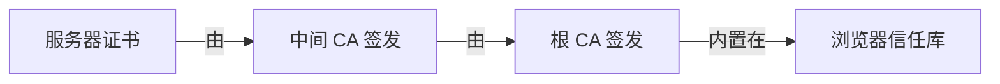
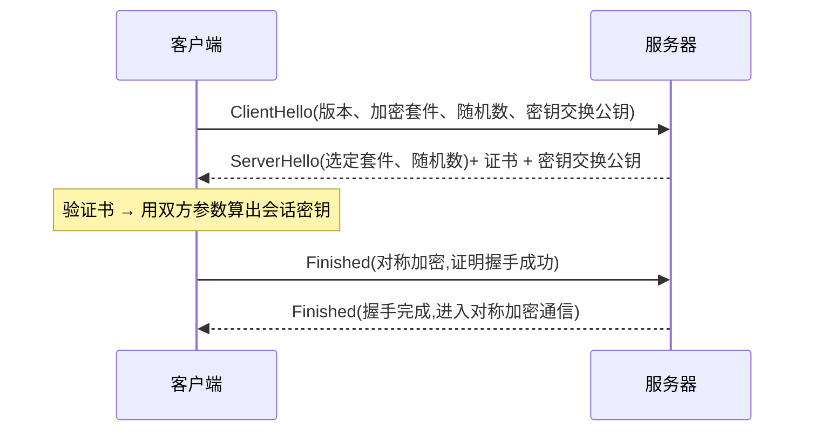

# 4.4 HTTPS 与 TLS

## 引言:HTTP 为什么"裸奔",HTTPS 加了三把锁

HTTP 明文传输,有三大风险:**窃听、篡改、冒充**。HTTPS = HTTP + TLS,用「加密」防窃听、「完整性校验」防篡改、「证书」防冒充。深挖要懂**混合加密**、**密钥交换(ECDHE)** 与 **数字签名**。

---

## 一、三风险 → 三对策

| 风险 | HTTPS 对策 |
|------|-----------|
| 窃听(明文被抓) | **对称加密** |
| 篡改(内容被改) | **完整性校验**(MAC/摘要) |
| 冒充(无法验身份) | **证书 + 非对称加密 + 签名** |

---

## 二、两种加密 + 数字签名

### 2.1 对称加密(AES)

一把密钥**既加密又解密**,快:

```js
// 同钥加解密
encrypt(key, plaintext)  → ciphertext
decrypt(key, ciphertext) → plaintext
```

- ✅ 快,适合加密海量数据
- ❌ 密钥分发难(把密钥明文发给对方 = 没加密)

### 2.2 非对称加密(RSA / ECDHE)

一对密钥:**公钥加密 → 私钥解密**(或反之):

```js
encrypt(publicKey, plaintext)  → ciphertext
decrypt(privateKey, ciphertext) → plaintext   // 只有私钥能解
```

- ✅ 公钥可公开,解决密钥分发
- ❌ 慢(大数运算),扛不住大流量

### 2.3 数字签名(哈希 + 私钥加密)

**私钥加密 = 签名;公钥解密 = 验签**:

```js
signature = encrypt(privateKey, hash(message))   // 用私钥"签"
// 验签:用公钥解出 hash,对比 message 的 hash
```

> 签名的作用:① **证明消息确实来自私钥持有者**(别人没有私钥,签不出来);② **证明内容没被篡改**(改了则 hash 对不上)。这是证书链验证身份的底层。

### 2.4 为什么混合加密

非对称慢、扛不住大流量;纯对称密钥分发不安全。所以:**非对称交换对称密钥(少量数据)→ 对称加密数据(大量数据)**。取两者之长。

---

## 三、密钥交换:双方都能算出共同密钥(ECDHE/DH)

关键难题:双方如何**在不泄露密钥的前提下,商量出一个共同的会话密钥**?

**DH/ECDHE 的核心思想**:

```js
// 公开的大素数 P、底数 G(公开)
// 双方各自生成私钥 a、b(保密),各自算公钥 A = G^a mod P、B = G^b mod P(公开交换)
// 关键:双方都能算出同一个值,但第三方算不出
alice共享密钥 = B^a mod P = (G^b)^a = G^(ab) mod P
bob共享密钥   = A^b mod P = (G^a)^b = G^(ab) mod P   // 相同!
```

> 数学魔法:双方**交换的是公钥(公开),各自用自己的私钥算出同一个共享密钥**,而第三方**只有公钥、没有私钥,算不出**。ECDHE 用椭圆曲线实现同原理,更快更安全。

---

## 四、证书链:防冒充的根基



### 4.1 证书里有什么

| 字段 | 含义 |
|------|------|
| 域名(SAN) | 这张证书合法用于哪个域名 |
| 公钥 | 该域名的公钥 |
| 有效期 | 起止时间 |
| 签发者 | 谁签发的(CA) |
| 签名 | CA 用私钥对证书内容的签名 |

### 4.2 验证流程

浏览器用**内置根 CA 公钥**逐级验签:根验中间、中间验服务器,确认"公钥确实属于该域名、证书没被篡改"。

### 4.3 中间人攻击(MITM)为何被挡下

攻击者想伪装成服务器,三条路都被堵死:

1. **自建证书** → 浏览器因根 CA 不信任而告警
2. **篡改真证书** → 签名校验不通过(改了内容 hash 对不上)
3. **冒充域名** → 拿不到该域名的合法证书(CA 只签发授权域名)

---

## 五、TLS 握手(详细)



**TLS 1.3 的改进:** 握手从 **2-RTT 降到 1-RTT**(0-RTT 会话恢复),删掉 RSA 密钥交换等不安全套件,只留 ECDHE 等前向安全套件。

**会话恢复(Session Resumption):** 首次握手后,双方缓存会话密钥,下次重连用 `session ticket` **跳过完整握手、直接复用**,实现 0-RTT——这是"HTTPS 也没那么慢"的关键。

---

## 六、HTTP/1.1 → 2 → 3

| 版本 | 改进 | 痛点 |
|------|------|------|
| HTTP/1.1 | 持久连接 | 队头阻塞、串行 |
| HTTP/2 | **多路复用**、头部压缩、二进制分帧 | 底层 TCP,丢包仍阻塞 |
| HTTP/3 | 基于 **QUIC(UDP)**、0-RTT、根治队头阻塞 | 新、中间设备适配 |

---

## 七、小结

```
HTTPS = HTTP + TLS
三对策:对称加密(防窃听)+ 完整性校验(防篡改)+ 证书/签名(防冒充)
混合加密:非对称换对称密钥 → 对称传数据;签名=私钥加密+哈希
密钥交换:ECDHE/DH 双方算出共同密钥(第三方算不出)
证书链:服务器证书→中间CA→根CA(浏览器信任);MITM 被三路堵死
演进:1.1(持久)→2(多路复用)→3(QUIC/UDP);TLS1.3 握手 1-RTT
```

---

## 八、面试题

**Q1:为什么 HTTPS 用"混合加密"而非纯对称/纯非对称?**

纯非对称太慢(大数运算);纯对称密钥分发不安全。混合:非对称只**安全交换**对称密钥(少量、慢没关系),大数据走对称(快),取长补短。

**Q2:证书怎么防止"中间人"伪造?**

① 证书由受信任 **CA 签名**;② 伪造者自建证书 → 根证书不受信任 → 浏览器告警;③ 篡改证书内容 → 签名校验不过;④ 冒充域名 → 拿不到合法证书。

**Q3:HTTP/2 的"多路复用"解决什么?**

HTTP/1.1 同连接请求**串行**、有队头阻塞;HTTP/2 用**二进制分帧**在同一条 TCP 上**并发多流**,消除队头阻塞、减连接数。(根治丢包级阻塞要 HTTP/3 的 QUIC。)

**Q4:TLS 握手的核心步骤?**

① ClientHello(版本/套件/随机数/公钥);② ServerHello + 证书 + 公钥;③ 客户端验证书、算出会话密钥;④ Finished,之后对称加密通信。

**Q5:HTTPS 能保证绝对安全吗?**

不能。HTTPS 保"**传输安全**"(加密、防篡改、防冒充),但不防:终端被入侵、证书私钥泄露、恶意 CA 签发假证书、以及应用层逻辑漏洞(CSRF/XSS 等)。

**Q6:`TLS 1.3` 相比 1.2 有哪些改进?**

① **握手从 2-RTT 降到 1-RTT**(0-RTT 会话恢复);② 删掉不安全的旧加密套件(RSA 密钥交换);③ 更安全、更快。

**Q7:数字签名是怎么实现的?为什么能防篡改?**

**哈希 + 私钥加密**:用私钥对消息的 hash 加密得到签名,验签时公钥解出 hash 与消息 hash 对比。别人没私钥签不出;改了内容 hash 对不上。所以既能**证明来源**又能**证明未篡改**。

**Q8:ECDHE/DH 密钥交换的精髓是什么?**

双方**交换公钥(公开)**,各自用**自己的私钥**算出**同一个共享密钥**(`G^(ab) mod P`)。第三方只有公钥、没私钥,算不出。这把"密钥分发"变成了"公开交换参数 + 各自计算",不泄露密钥。

**Q9:什么是会话恢复(Session Resumption)?价值?**

首次握手后缓存会话密钥,下次用 `session ticket` **跳过完整握手直接复用**,实现 **0-RTT**。大幅降低 HTTPS 重复连接的握手延迟。

**Q10:HS 握手为什么先验证书再传数据?**

顺序是"**先验身份(证书)→ 再换密钥(非对称)→ 再传数据(对称)**"。不先验证书,就可能在跟**中间人**换密钥、传数据,加密也白搭。身份是加密的前提。

---

📎 参考:[MDN《HTTPS》](https://developer.mozilla.org/zh-CN/docs/Web/Security/Transport_Layer_Security)、[MDN《TLS》](https://developer.mozilla.org/zh-CN/docs/Glossary/TLS)、[MDN《数字签名》](https://developer.mozilla.org/zh-CN/docs/Glossary/Digital_signature)、RFC 8446(TLS 1.3)