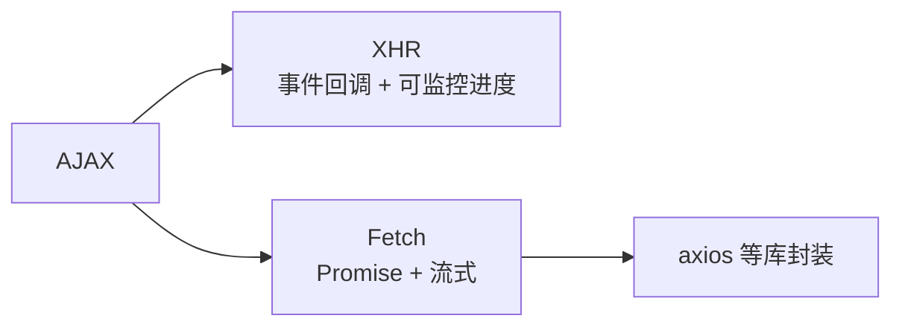

# 4.5 浏览器通信能力(XHR / Fetch / axios / SSE / WebSocket)

> 卷:卷四 · 网络与通信
> 阅读时间:25min

---

## 引言:浏览器能"自己发请求",也能"让 JS 发请求"

浏览器作为**用户代理**,有两能力:**自动发送请求、自动解析响应**。后来它们被开放给 JS,才有了 AJAX(Asynchronous JavaScript And XML,异步的 JavaScript 与 XML)。四类常用通信缩写先记全称:XHR = XMLHttpRequest;SSE = Server-Sent Events(服务器发送事件);WebSocket = 双向长连接。深挖要懂 Fetch 的**流式本质**与 axios 拦截器的原理。

---

## 一、用户代理:自动发请求 & 自动解析

**自动发请求**:地址栏回车、`<a>`/``/`<script>`/`<link>`、表单提交(GET 约定不带请求体)。

**自动解析响应(按 Content-Type):**

| `Content-Type` | 动作 |
|----------------|------|
| `text/html` | 渲染页面 |
| `text/css` | 样式 |
| `text/javascript` | JS 执行 |
| `image/*` | 图片 |
| `application/octet-stream` / `Content-Disposition: attachment` | 下载 |

---

## 二、XHR vs Fetch(一图 + 表)



| | XHR | Fetch |
|---|-----|-------|
| 形态 | 事件回调 | **Promise** |
| 进度 | ✅ `onprogress` | ❌ 原生无 |
| 中止 | `abort()` | `AbortController` |
| 状态 | 已基本停更 | 现代主流 |

```js
fetch("/api").then((r) => r.json()).then((data) => console.log(data));
```

---

## 三、Fetch 的流式本质(深层,易错)

> `fetch()` 返回的 promise 在**收到响应头**时就 resolve,此时 **body 还没传输完**;要拿到数据得再 `await r.json()/text()`。因为响应体是**流式**的,不一次性到齐。

```js
const r = await fetch("/api");  // 只拿到响应头
const data = await r.json();    // 这才读完响应体
```

**衍生**:大文件/流式场景可边收边处理 `r.body`(ReadableStream),无需等全部到齐。

---

## 四、axios:基于 XHR 的封装(原理)

axios 底层 XHR(Node 用 http),在其上加实用能力:

```js
// 拦截器:请求/响应统一加 token、统一错误处理
axios.interceptors.request.use((config) => {
  config.headers.Authorization = `Bearer ${token}`;
  return config;
});
axios.interceptors.response.use(
  (res) => res.data,                          // 统一剥壳
  (err) => { if (err.response?.status === 401) redirect(); return Promise.reject(err); }
);
```

> 拦截器原理:axios 内部维护一个**拦截器链**——请求前依次过"请求拦截器",响应后反向过"响应拦截器",本质是"中间件/责任链"模式。

---

## 五、服务器推送:SSE vs WebSocket

| | SSE | WebSocket |
|---|-----|-----------|
| 方向 | 单向(服务器→客户端) | **双向** |
| 协议 | HTTP(`text/event-stream`) | ws(先 HTTP 升级) |
| 实现 | 原生 `EventSource` | 需库/手写 |
| 场景 | 通知、行情 | 聊天、协作、游戏 |

```js
const es = new EventSource("/events");   // SSE
es.onmessage = (e) => console.log(e.data);

const ws = new WebSocket("wss://x.com"); // WebSocket 双向
ws.onopen = () => ws.send("hi");
```

---

## 六、小结

```
用户代理:自动发请求(a/img/link/表单)、自动解析(Content-Type)
XHR(事件/可监控进度)vs Fetch(Promise/流式,收到头即 resolve)
axios = 基于 XHR 封装(拦截器链/取消/统一配置)
推送:SSE(单向)/ WebSocket(双向,ws)
```

---

## 七、面试题

**Q1:`fetch` 的 promise 何时 resolve?body 何时能拿到?**

`fetch` 在**收到响应头**时 resolve(此时 body 还是空流),需再 `response.json()/text()` **读完响应体**才有数据。原因是响应体**流式传输**。

**Q2:axios 拦截器是怎么实现的?**

axios 内部用一个**拦截器链(责任链)**:请求时依次执行"请求拦截器"→发请求→依次反向执行"响应拦截器"。统一 token 注入、错误处理都靠它。

**Q3:账号 token 放 header 统一注入,怎么用 axios 做?**

```js
axios.interceptors.request.use((c) => { c.headers.Authorization = `Bearer ${token}`; return c; });
```

**Q4:实时聊天用什么?为什么不用轮询/SSE?**

用 **WebSocket**:聊天是**双向、低延迟、高频**,轮询浪费且延迟高,SSE 只能服务器→客户端单向。WebSocket 全双工一条长连接双向收发,最贴合。

**Q5:如何中止一个 Fetch 请求?AbortController 的底层原理?**

用 **AbortController** + **AbortSignal**:`fetch(url, { signal })` 传入 signal,调用 `ac.abort()` 触发 signal 的 `abort` 事件,fetch 监听到后**取消底层网络请求并 reject(AbortError)**。

```js
const ac = new AbortController();
fetch(url, { signal: ac.signal });
ac.abort();   // 中止,reject AbortError
```

> 底层原理:`AbortController`(控制器)与 `AbortSignal`(信号)是**一对**——控制器发"中止指令",信号传递"中止事件";一个 controller 的 signal 可传给多个请求(一键中止多请求),也可 `signal.addEventListener('abort', ...)` 自定义中止逻辑。

📎 官方:MDN《AbortController》《AbortSignal》

**`AbortSignal.timeout(ms)`(静态便捷版):**

无需手动 new controller,直接返回一个**到时间自动 abort 的 signal**:

```js
fetch(url, { signal: AbortSignal.timeout(5000) });   // 5 秒超时自动中止
```

> 与手动 AbortController 相比:适合"只想要个超时"的简单场景;需要手动提前中止或一信号控多请求时,仍用 AbortController。

📎 官方:MDN《AbortSignal.timeout()》

**Q6:XHR 相比 Fetch 的一个独有优势是什么?**

**上传/下载进度监控**——XHR 有 `onprogress`/`upload.onprogress` 事件,能拿到进度做进度条;原生 Fetch 至今不支持(需 ReadableStream 自己算)。

---

📎 参考:MDN《Fetch API》《EventSource》《WebSocket》、axios 官方文档