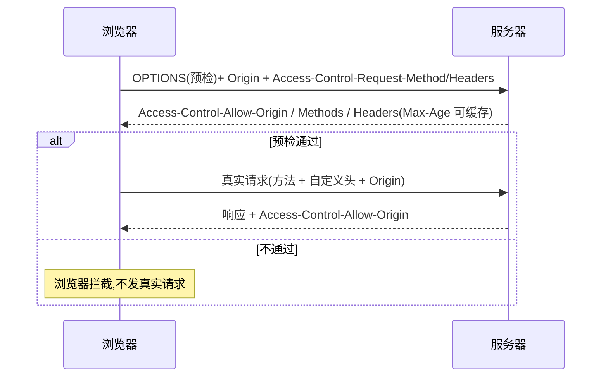

# 4.6 跨域与同源策略

> 卷:卷四 · 网络与通信
> 难度:⭐⭐⭐ 专家 | 阅读时间:30min | 状态:进行中

---

## 引言:同源是规矩,跨域是需求,矛盾靠机制调和

浏览器的**同源策略**是安全基石,但前后端分离让"跨域"成了日常需求。CORS 是正统解法,JSONP 是历史,代理是"绕"。本章把整套理清。

---

## 一、同源策略:什么是"同源"

> **源(Origin)= 协议 + 域名 + 端口**,三者完全一致才算同源。

| URL | 是否同源 |
|-----|---------|
| `https://a.com:443/x` vs `https://a.com/y` | ✅ 同源 |
| `http://a.com` vs `https://a.com` | ❌ 协议不同 |
| `a.com` vs `b.a.com` | ❌ 域名不同 |
| `a.com:80` vs `a.com:8080` | ❌ 端口不同 |

**跨域限制出现的三种场景:**

1. **网络通信**:AJAX 请求、加载资源
2. **JS API**:`window.open`、`window.parent`、`iframe.contentWindow` 互相访问
3. **存储**:`localStorage`、`IndexedDB` 的访问

> 关键前提:**这些是"浏览器"的限制**,不是"服务器"或"协议"的限制——请求本身可能已发出/返回,是浏览器拦下了 JS 读取结果。

---

## 二、两类跨域请求的"松紧"

- **标签发出**的跨域请求(如 ``/`<script>`/`<link>`)→ 浏览器**放行**(所以 JSONP 才有空子钻)
- **AJAX 发出**的跨域请求 → 浏览器**严格限制**(默认读不到响应)

---

## 三、CORS:正统解法

**核心理念:以服务器"明确允许"为准。**

```
服务器响应头带 Access-Control-Allow-Origin → 浏览器校验通过 → JS 可读响应
```

### 1. 两种请求:简单请求 vs 预检请求

**简单请求**(同时满足):方法为 `GET/POST/HEAD` + 头部是"安全头" + `Content-Type` 限三种(`text/plain` / `multipart/form-data` / `application/x-www-form-urlencoded`)。

**预检请求**:不满足上述任一(如自定义头、`application/json`、`PUT/DELETE`)→ 先发 **OPTIONS** 探路。

### 2. 预检流程图



### 3. 关键响应头

| 响应头 | 作用 |
|--------|------|
| `Access-Control-Allow-Origin` | 允许的源(`*` 或具体源) |
| `Access-Control-Allow-Methods` | 允许的方法 |
| `Access-Control-Allow-Headers` | 允许的头 |
| `Access-Control-Allow-Credentials` | 是否允许携带 cookie |
| `Access-Control-Expose-Headers` | 允许 JS 读取的响应头白名单 |
| `Access-Control-Max-Age` | 预检结果缓存秒数 |

---

## 四、两个易错细节

### 1. Cookie 凭证

默认**跨域请求不带 cookie**;要带需两处配合:

```js
// 前端
fetch(url, { credentials: 'include' });  // xhr: withCredentials = true
```

```http
; 服务器:必须返回
Access-Control-Allow-Credentials: true
```

> ⚠️ 带凭证时 `Access-Control-Allow-Origin` **不能是 `*`**,必须写具体源——这是"不建议用 `*`"的重要原因。

### 2. 跨域能读哪些响应头

跨域下 JS 只能读**基础头**(`Cache-Control`/`Content-Language`/`Expires`/`Pragma` 等);想读自定义头,服务器要用 `Access-Control-Expose-Headers` 白名单放行:

```http
Access-Control-Expose-Headers: authorization, x-request-id
```

---

## 五、JSONP:历史方案(不推荐)

原理:利用 `<script>` 标签**不受同源限制**的特点,动态插入 script,服务器返回一段调用回调的 JS:

```js
function jsonp(url) {
  return new Promise((resolve) => {
    const cb = `_cb_${Math.random().toString(36).slice(2)}`;
    window[cb] = (data) => { resolve(data); delete window[cb]; script.remove(); };
    const script = document.createElement("script");
    script.src = `${url}?callback=${cb}`;
    document.body.appendChild(script);
  });
}
// 服务器返回: _cb_xxx({...data})
```

**致命缺陷:**

- ❌ 只能 GET(script 标签只能 GET)
- ❌ **XSS 风险**:回调名可被注入恶意代码,信任了第三方脚本

> **除非特殊历史原因,永远别用 JSONP。**

---

## 六、代理方案:服务器不是"自己人"时

CORS 需要服务器配合;若目标服务器是第三方(不可配置),就用**代理服务器**中转:

```
浏览器 → 同源代理(/api) → 目标服务器
```

- **开发环境**:Vite `server.proxy` / webpack devServer proxy
- **生产环境**:Nginx 反向代理、网关

> 优点:对浏览器来说"全程同源",根本没有跨域问题;还能顺便解决"服务端之间无跨域 + 统一鉴权"。

---

## 七、小结

```
同源 = 协议 + 域名 + 端口 一致;跨域是"浏览器"的限制(非服务器)

三场景:网络通信 / JS API / 存储
CORS:服务器说允许(Access-Control-Allow-*)
  ├─ 简单请求:直接带 Origin 请求
  └─ 预检请求:先 OPTIONS,再真实请求
凭证:要带 cookie 必须 Allow-Credentials + Origin 不能 *
JSONP:script 标签钻空子,仅 GET + XSS 风险(不推荐)
代理:服务器不是自己人,就中转成"同源"
```

---

## 八、面试题

**Q1:什么时候会触发 CORS 预检请求?**

只要请求**不是简单请求**就触发:方法非 `GET/POST/HEAD`、或带了**非安全的自定义头**、或 `Content-Type` 不是那三种(如 `application/json` 就触发)。预检用 `OPTIONS` 方法先行探测。

**Q2:跨域请求为什么"默认不带 cookie"?带了要注意什么?**

安全考虑,默认隔离身份凭证。要带:前端 `credentials: 'include'` / `withCredentials=true`,且服务器必须返回 `Access-Control-Allow-Credentials: true`,此时 `Access-Control-Allow-Origin` **不能是 `*`**。

**Q3:为什么说 CORS 是"浏览器端"的机制,不是服务器端的?**

因为请求可能已经被服务器正常处理并返回了,**是浏览器**在 JS 层拦截"跨域读不到响应"。服务器加 CORS 头,本质是"授权浏览器把这个响应交给 JS"。所以用 `curl`/后端直接请求没有跨域问题,只有"浏览器里的 JS"才有。

---

📎 参考:MDN《CORS》《同源策略》、W3C Fetch 规范(credentials/CORS)