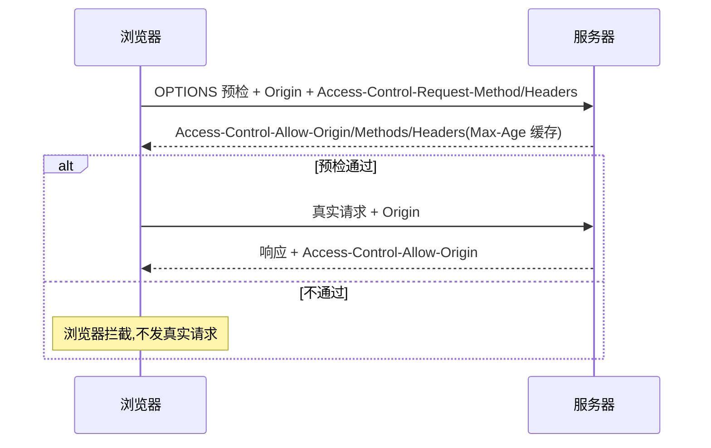

# 4.6 跨域与同源策略

> 卷:卷四 · 网络与通信
> 阅读时间:30min

---

## 引言:同源是规矩,跨域是需求,矛盾靠机制调和

同源策略是浏览器安全基石,前后端分离让"跨域"成日常需求。CORS 是正统解,JSONP 是历史,代理是"绕"。深挖要懂**简单/预检的判定细节**与 **credentials 的严格约束**。

---

## 一、同源策略:什么是"同源"

> **源(Origin)= 协议 + 域名 + 端口**,三者全一致才算同源。

**跨域限制三场景:** ① 网络通信(AJAX);② JS API(`window.open`/`parent`/`iframe`);③ 存储(`localStorage`/`IndexedDB`)。

> 关键前提:这是**浏览器**的限制,不是服务器/协议的限制——请求可能已发出/返回,是**浏览器拦下 JS 读结果**。

**跨窗口通信:`postMessage`(跨域时的安全桥梁)**

同源策略禁止跨域页面互相读写 `window`/`parent`/`iframe` 的内容,但 **`postMessage`** 提供了**受控的跨窗口消息通道**:

```js
// 子页面 iframe 里:向父页面发消息
parent.postMessage({ type: "login", token }, "https://parent.com");

// 父页面:接收并校验来源
window.addEventListener("message", (e) => {
  if (e.origin !== "https://child.com") return;   // 必须校验 origin!
  console.log(e.data);
});
```

> 安全铁律:`postMessage` 的两个参数都要重视——**targetOrigin 必须写具体源**(别用 `*`),接收端**必须校验 `e.origin`**,否则会被恶意页面伪造消息。

**浏览器存储对比(同源策略在不同存储上的体现):**

| 存储 | 作用域 | 同源限制 | 容量 | 生命周期 |
|------|--------|---------|------|---------|
| Cookie | 每请求自动带 | SameSite/域名控制 | ~4KB | 可设过期 |
| localStorage | 同源共享 | 严格同源 | ~5MB | 永久 |
| sessionStorage | 同源 + 单标签页 | 严格同源 | ~5MB | 关闭标签页即清 |
| IndexedDB | 同源共享 | 严格同源 | 几百 MB | 永久 |

> 持久且跨标签 = localStorage;持久单标签 = sessionStorage;随请求带 = Cookie;大容量结构化 = IndexedDB。

---

## 二、简单请求 vs 预检请求(判定细节)

**简单请求**(同时满足全部):

```
① 方法 ∈ {GET, POST, HEAD}
② 头部是"安全头"(不改动浏览器默认头)
③ Content-Type ∈ {text/plain, multipart/form-data, application/x-www-form-urlencoded}
```

**任一不满足 → 预检请求**(先 OPTIONS 探路)。

> 记忆触发点:**`application/json`、自定义头(如 Authorization)、PUT/DELETE** 都会触发预检。

---

## 三、CORS 流程



**关键响应头:**

| 头 | 作用 |
|----|------|
| `Access-Control-Allow-Origin` | 允许的源 |
| `Access-Control-Allow-Methods` | 允许的方法 |
| `Access-Control-Allow-Headers` | 允许的头 |
| `Access-Control-Allow-Credentials` | 是否允许凭证 |
| `Access-Control-Expose-Headers` | JS 可读响应头白名单 |
| `Access-Control-Max-Age` | 预检缓存秒数 |

---

## 四、两个易错细节

### 1. Cookie 凭证

默认跨域请求不带 cookie;要带需两端配合:

```js
fetch(url, { credentials: 'include' });   // 前端带上
```

```http
Access-Control-Allow-Credentials: true   ; 服务器必须回
```

> ⚠️ 带凭证时 `Access-Control-Allow-Origin` **不能是 `*`**,必须写具体源。

### 2. 跨域能读哪些响应头

跨域下 JS 只能读基础头(`Cache-Control`/`Content-Language`/`Expires` 等);要读自定义头,服务器用 `Access-Control-Expose-Headers` 放行。

---

## 五、JSONP 与代理

**JSONP(JSON with Padding)**:`<script>` 标签不受同源限制,动态插 script,服务器返回回调。缺陷:只能 GET、**XSS 风险**(信任第三方脚本)。**永远别用**。

**代理**:目标服务器不是"自己人"时,用同源代理中转,浏览器全程同源、无跨域问题:

```js
// Vite dev
server: { proxy: { '/api': { target: 'https://x.com', changeOrigin: true } } }
```

---

## 六、小结

```
同源 = 协议+域名+端口;跨域是"浏览器"限制,非服务器
CORS:简单请求(直接带 Origin)vs 预检(先 OPTIONS);服务器用 ACAO 等头放行
凭证:带 cookie 需 Allow-Credentials + Origin 不能 *
JSONP:script 标签钻空,仅 GET + XSS 风险(不用);代理:中转成同源
```

---

## 七、面试题

**Q1:什么时候触发 CORS 预检?**

只要**不是简单请求**:方法非 GET/POST/HEAD、带非安全自定义头、或 `Content-Type` 不是那三种(如 `application/json`)。

**Q2:跨域请求为什么默认不带 cookie?带了要注意什么?**

安全隔离。要带:前端 `credentials:'include'`,服务器 `Access-Control-Allow-Credentials: true`,且 `Access-Control-Allow-Origin` **不能是 `*`**。

**Q3:为什么说 CORS 是"浏览器端"机制而非服务器端?**

请求可能已被服务器处理并返回,**浏览器**在 JS 层拦"跨域读不到响应"。服务器加 CORS 头 = "授权浏览器把响应交给 JS"。所以 `curl`/后端请求无跨域问题,只有浏览器里的 JS 有。

**Q4:OPTIONS 预检请求会缓存吗?靠什么?**

会。靠 `Access-Control-Max-Age: 秒数`,告诉浏览器"这段时间内不必再预检"。减少重复 OPTIONS,降低请求数。

**Q5:如何让跨域下 JS 能读自定义响应头(如 `x-token`)?**

服务器加 `Access-Control-Expose-Headers: x-token`,把它放进"允许 JS 读取"的白名单,否则 JS 读不到。

**Q6:JSONP 的原理和致命缺陷?**

原理:`<script>` 不受同源限制,动态插 script、服务器返回 `callback(data)` 执行。缺陷:① **只能 GET**;② **XSS 风险**(回调名可被注入恶意代码)。除非历史原因,永远别用。

---

📎 参考:MDN《CORS》《同源策略》、W3C Fetch 规范