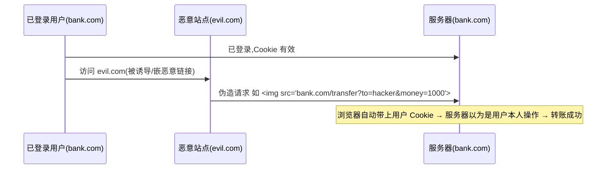

# 4.7 Web 安全(XSS / CSRF / CSP)

> 卷:卷四 · 网络与通信
> 难度:⭐⭐⭐ 专家 | 阅读时间:25min | 状态:进行中

---

## 引言:前端不是"安全绝缘体"

前端常见攻击集中在两大家族:**XSS(跨站脚本攻击)** 和 **CSRF(跨站请求伪造)**。前者是"注入恶意脚本",后者是"冒充用户发请求"。本章给原理 + 防御 + 面试标准答案。

---

## 一、XSS:跨站脚本攻击

**本质:把恶意脚本注入页面,借受害者的浏览器执行,窃取 cookie/冒充操作。**

### 1. 三种类型

| 类型 | 注入位置 | 触发 |
|------|---------|------|
| **存储型** | 存入服务器(评论、资料)→ 所有人访问页面时执行 | 最严重 |
| **反射型** | 藏在 URL 参数里,点击恶意链接触发 | 需诱导点击 |
| **DOM 型** | 前端 JS 把不可信数据写进 `innerHTML` | 纯前端 |

```js
// DOM 型 XSS 示例:用户输入被直接当 HTML 渲染
document.querySelector(".msg").innerHTML = userInput;  // userInput = ""
```

### 2. 防御

```js
// ① 输出转义:数据永远当"文本"而非"HTML"处理
el.textContent = userInput;      // ✅ 不解析 HTML
// el.innerHTML = userInput;     // ❌ 危险

// ② 永远不要用 eval / new Function 执行用户输入
// ③ 富文本场景:白名单过滤(如 sanitize-html / DOMPurify)
// ④ Cookie 设 HttpOnly(JS 读不到,即使脚本注入也偷不走 cookie)
```

> **核心思想:凡是"用户可控的输入",绝不能未经处理就当作"代码/HTML"执行。**

---

## 二、CSRF:跨站请求伪造

**本质:借用户的登录态,诱导用户在不知情下发起一个"自己并不想发"的请求。**



> 关键:**CSRF 利用的是"浏览器会自动带上 cookie"**,而不是"偷到 cookie"(偷 cookie 是 XSS 干的)。

### 防御

| 方法 | 原理 |
|------|------|
| **CSRF Token** | 表单/请求带随机 token,服务器校验;攻击者跨站无法拿到 token |
| **SameSite Cookie** | `SameSite=Lax/Strict`:跨站请求不自动带 cookie |
| **校验 Referer/Origin** | 检查请求来源是否可信 |
| 关键操作用 POST + 二次验证 | 提高伪造门槛 |

```http
Set-Cookie: session=xxx; SameSite=Lax; HttpOnly
```

---

## 三、CSP:内容安全策略

**CSP 用响应头白名单,告诉浏览器"允许加载哪些资源、禁止哪些"**,是防 XSS 的强力兜底:

```http
Content-Security-Policy:
  default-src 'self';              /* 默认只允许同源 */
  script-src 'self' trusted-cdn.com; /* 脚本只允许同源 + 指定 CDN */
  img-src *;                        /* 图片可任意 */
  style-src 'self' 'unsafe-inline';
```

**效果:即使有 XSS 注入,内联脚本/非法源脚本也会被浏览器拒绝执行**(配合 `script-src 'self'` + nonce)。

> 一句话:CSP 是"**再被攻破也执行不了恶意脚本**"的最后一道墙。

---

## 四、其他安全投递(速记)

| 头 | 作用 |
|----|------|
| `X-Frame-Options` / `CSP frame-ancestors` | 防点击劫持(不被别人 iframe 嵌入) |
| `X-Content-Type-Options: nosniff` | 防止浏览器嗅探 MIME 类型 |
| `Referrer-Policy` | 控制 Referer 泄露范围 |
| `Strict-Transport-Security`(HSTS) | 强制 HTTPS |
| `HttpOnly` / `Secure` Cookie | 防 JS 读 cookie / 仅 HTTPS 传输 |

---

## 五、小结

```
XSS:注入恶意脚本(存储/反射/DOM)
  → 防御:输出转义、不用 eval、富文本白名单、Cookie HttpOnly、CSP

CSRF:借登录态伪造请求(cookie 自动带上)
  → 防御:CSRF Token、SameSite Cookie、校验 Origin/Referer

CSP:资源加载白名单,防 XSS 的最后兜底
辨析:XSS 是"偷/执行",CSRF 是"冒用身份发请求"
```

---

## 六、面试题

**Q1:XSS 和 CSRF 的本质区别?**

**XSS** 是"**注入脚本**"——攻击者要的是在受害者浏览器里**执行恶意代码**(窃取 cookie、操作 DOM);**CSRF** 是"**伪造请求**"——利用浏览器自动带 cookie 的机制,让受害者**在不知情下发请求**(转账、改密码),攻击者拿不到响应内容,只借用户的身份做事。

**Q2:为什么 `HttpOnly` cookie 能防 XSS 却防不了 CSRF?**

`HttpOnly` 让 **JS 读不到 cookie**(XSS 偷不到),但**请求时浏览器仍会自动带上 cookie**——CSRF 恰恰利用这个"自动带"的特性,所以 HttpOnly 对 CSRF 无效。防 CSRF 靠 `SameSite` + CSRF Token。

**Q3:如何从"前端"角度防御 XSS?至少三条**

① 用户输入一律转义/用 `textContent` 渲染,不直接 `innerHTML`;② 不用 `eval`/`new Function` 执行不可信数据;③ 富文本用白名单清洗库(DOMPurify);④ 配合 CSP 与 `HttpOnly` cookie 兜底。

---

📎 参考:OWASP《XSS》《CSRF》Cheat Sheet、MDN《CSP》《SameSite cookies》