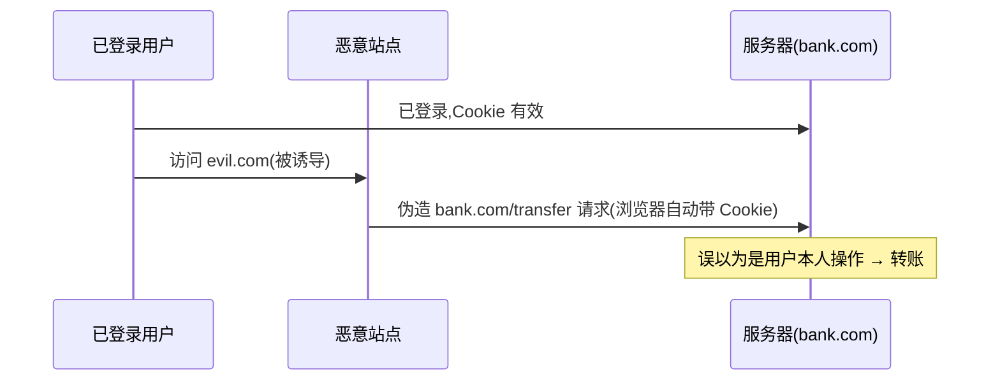

# 4.7 Web 安全(XSS / CSRF / CSP)

> 卷:卷四 · 网络与通信
> 难度:⭐⭐⭐ 专家 | 阅读时间:25min | 状态:深度增强

---

## 引言:前端不是"安全绝缘体"

前端常见攻击两大族:**XSS(注入脚本)** 与 **CSRF(冒用身份发请求)**。深挖要懂"防御的底层逻辑",以及 **SameSite** 的三种值。

---

## 一、XSS:跨站脚本攻击

**本质:把恶意脚本注入页面,借受害浏览器执行,窃取 cookie/冒充操作。**

| 类型 | 注入位置 | 触发 |
|------|---------|------|
| **存储型** | 存服务器(评论)→所有人访问执行 | 最严重 |
| **反射型** | 藏 URL 参数,点恶意链接触发 | 需诱导 |
| **DOM 型** | JS 把不可信数据写进 innerHTML | 纯前端 |

```js
el.innerHTML = userInput;  // ❌ 危险:userInput 可能含 
el.textContent = userInput; // ✅ 当纯文本
```

**防御四件套:**

1. **输出转义**(数据当文本,不当 HTML)
2. **不用 eval/new Function** 执行不可信数据
3. **富文本白名单清洗**(DOMPurify)
4. **Cookie HttpOnly**(JS 读不到)+ **CSP** 兜底

---

## 二、CSRF:跨站请求伪造(一图)



> **CSRF 利用的是"浏览器自动带 cookie",不是"偷 cookie"**(偷 cookie 是 XSS 干的)。

### 防御(底层)

| 方法 | 原理 |
|------|------|
| **CSRF Token** | 请求带随机 token,攻击者跨站拿不到 |
| **SameSite Cookie** | 跨站请求不带 cookie |
| **校验 Origin/Referer** | 检查请求来源 |
| 关键操作 POST + 二次验证 | 提高门槛 |

**SameSite 三值(细节):**

```http
Set-Cookie: session=xxx; SameSite=Lax
```

| 值 | 跨站是否带 cookie | 场景 |
|----|------------------|------|
| `Strict` | **绝不**带 | 最严,但用户从站外点链进来会"掉登录" |
| `Lax`(默认推荐) | 顶级导航(GET 链接)带,其他不带 | 平衡:能防 CSRF 又不破坏直达链接 |
| `None` | 都带 | 需配合 `Secure`(仅 HTTPS),跨站场景用 |

---

## 三、CSP:内容安全策略

用响应头白名单,告诉浏览器"允许加载哪些资源、禁止哪些":

```http
Content-Security-Policy:
  default-src 'self';
  script-src 'self' trusted-cdn.com;
  img-src *;
```

> **即使有 XSS 注入,内联/非法源脚本也会被浏览器拒绝执行**——CSP 是"最后一道墙"。

---

## 四、其他安全投递(速记)

```http
X-Frame-Options: DENY / SAMEORIGIN     ; 防点击劫持
X-Content-Type-Options: nosniff        ; 防 MIME 嗅探
Referrer-Policy: no-referrer           ; 控 Referer 泄露
Strict-Transport-Security (HSTS)       ; 强制 HTTPS
Set-Cookie: ...; HttpOnly; Secure; SameSite=Lax
```

---

## 五、小结

```
XSS:注入脚本(存储/反射/DOM)→ 输出转义/eval禁/白名单/HttpOnly/CSP
CSRF:借登录态伪造请求(cookie 自动带)→ CSRF Token/SameSite/Origin
CSP:资源白名单,最后兜底;SameSite:Strict/Lax(推荐)/None+Secure
辨析:XSS="执行",CSRF="冒用身份发请求"
```

---

## 六、面试题

**Q1:XSS 和 CSRF 的本质区别?**

XSS 是"**注入脚本**"——要在受害浏览器里**执行**恶意代码(窃取/操作);CSRF 是"**伪造请求**"——利用 cookie 自动带,让受害者**不知情发请求**,攻击者拿不到响应内容,只借身份做事。

**Q2:为什么 HttpOnly cookie 能防 XSS 却防不了 CSRF?**

`HttpOnly` 让 JS **读不到** cookie(XSS 偷不到),但**请求时浏览器仍自动带** cookie——CSRF 恰恰利用"自动带"。所以 HttpOnly 对 CSRF 无效,防 CSRF 靠 `SameSite` + CSRF Token。

**Q3:`SameSite=Strict` 和 `Lax` 的区别?**

`Strict` 任何跨站请求都不带 cookie(最严,但站外点链接会掉登录);`Lax` 只有"顶级导航 GET"(点链接打开)带,其余(iframe/图片/AJAX POST)不带——默认推荐,平衡安全与体验。

**Q4:CSP 如何防御 XSS?**

CSP 用 `script-src` 白名单限制可执行脚本来源,`'self'` 只允许同源,内联脚本被禁(除非 nonce/hash)。于是即使攻击者注入了 `<script>`/事件处理器,浏览器也**拒绝执行**。

**Q5:如何从"前端"角度防御 XSS?三条**

① 用户输入转义/用 `textContent` 渲染,不直接 `innerHTML`;② 不用 `eval`/`new Function` 执行不可信数据;③ 富文本用 DOMPurify 白名单清洗;④ 配合 CSP 与 HttpOnly cookie 兜底。

**Q6:什么是"存储型 XSS"?为什么它最危险?**

恶意脚本被**存进服务器**（如评论、昵称）,任何用户访问相关页面时都被执行。危险在于:**无需诱导点击**,所有访问者自动中招,影响面最大。

---

📎 参考:OWASP《XSS》《CSRF》Cheat Sheet、MDN《CSP》《SameSite cookies》